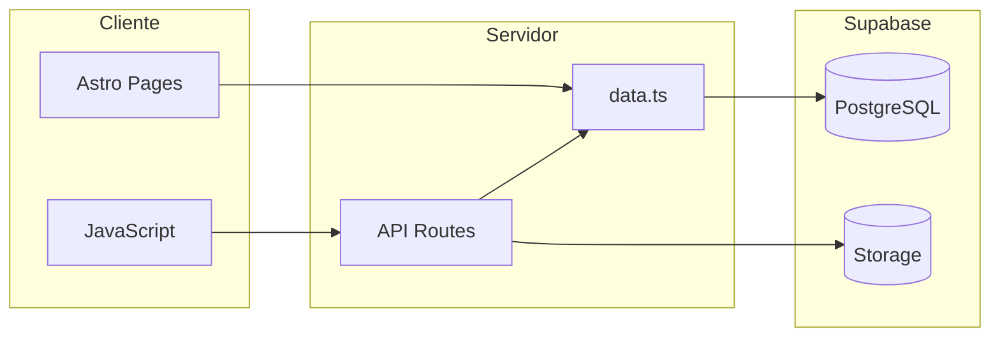
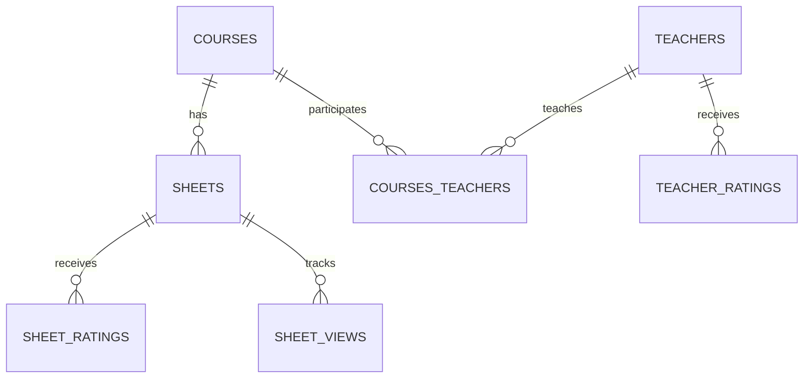
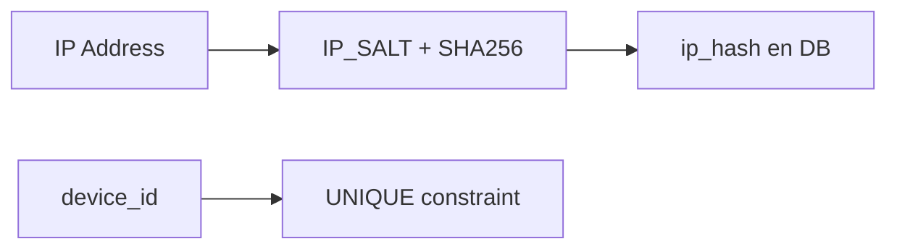

# Arquitectura del Proyecto

## Objetivo

TrikaWeb centraliza recursos académicos (planchas y solucionarios) y permite a
estudiantes calificar planchas y profesores con controles anti-spam.

## Stack Técnico

| Capa | Tecnología |
|------|------------|
| **Frontend** | Astro + Tailwind CSS |
| **Backend** | Astro API Routes (`src/pages/api`) |
| **Base de datos** | Supabase (PostgreSQL) |
| **Storage** | Supabase Storage (buckets) |
| **Deploy** | Vercel (`@astrojs/vercel` adapter) |

## Estructura del Proyecto

```
src/
├── components/      # UI reutilizable (Cards, Modals, SearchBar...)
├── layouts/         # Layout base de páginas
├── lib/             # Lógica de acceso a datos y utilidades
│   ├── data.ts      # Funciones de consulta (getCourses, searchEntities...)
│   ├── supabase.client.ts   # Cliente público de Supabase
│   └── supabase.admin.ts    # Cliente admin (Service Key)
├── pages/
│   ├── admin/       # Vistas de administración
│   ├── api/         # Endpoints HTTP (ver api.md)
│   ├── curso/       # Rutas dinámicas /curso/[code]
│   ├── exams/       # Detalle de planchas /exams/[id]
│   └── profesores/  # Listado y detalle de profesores
└── styles/          # Estilos globales

supabase/
├── schema.sql              # Definición de tablas
├── function_triggers.sql   # Triggers para métricas derivadas
└── migrations/             # Migraciones incrementales
```

## Diagramas de Flujo

Para diagramas visuales detallados, ver [`flujos.md`](flujos.md):
- Arquitectura general del sistema
- Flujo de consultas y calificaciones
- Modelo de datos (ER)
- Sistema anti-spam

## Flujo de Datos



1. **Frontend** consulta datos vía `src/lib/data.ts` (cliente público de Supabase).
2. **Operaciones sensibles** (subida de archivos, ratings, moderación) pasan por API.
3. **Endpoints admin** usan `supabaseAdmin` (Service Key) y validación de sesión.
4. **Archivos PDF** se guardan en buckets `exams` y `solutions`.

## Modelo de Datos

### Tablas Principales

| Tabla | Descripción |
|-------|-------------|
| `courses` | Cursos (`code`, `name`, `credits`) |
| `teachers` | Docentes (`full_name`, `bio`, `avg_overall`, `is_hidden`) |
| `courses_teachers` | Relación N:M cursos ↔ docentes |
| `sheets` | Planchas y solucionarios (metadata + paths) |
| `sheet_ratings` | Votos de dificultad por plancha |
| `sheet_views` | Eventos de vista/descarga |
| `teacher_ratings` | Calificaciones de profesores |
| `write_limits` | Control de rate-limit por IP |

### Diagrama ER

Ver diagrama completo en [`flujos.md#modelo-de-datos-er-simplificado`](flujos.md#modelo-de-datos-er-simplificado).



## Triggers y Cálculos Derivados

Definidos en `supabase/function_triggers.sql`:

| Trigger | Tabla origen | Efecto |
|---------|--------------|--------|
| `refresh_sheet_stats` | `sheet_ratings` | Recalcula `avg_difficulty` y `rating_count` en `sheets` |
| `refresh_view_count` | `sheet_views` | Recalcula `view_count` en `sheets` |
| `refresh_teacher_stats` | `teacher_ratings` | Recalcula `avg_overall` y `rating_count` en `teachers` |

## Seguridad

### Identificación de Usuarios



- **`ip_hash`**: IP hasheada con `IP_SALT` (nunca se guarda IP en claro).
- **`device_id`**: UUID generado en cliente para limitar votos duplicados.
- **Rate limiting**: Tabla `write_limits` por IP en endpoints de escritura.

### Autenticación Admin

- Cookie de sesión (`admin_session`) validada con Supabase Auth.
- Service key (`SUPABASE_SERVICE_KEY`) solo en servidor.

## Storage Buckets

| Bucket | Contenido | Acceso |
|--------|-----------|--------|
| `exams` | PDFs de planchas | Signed URLs (tiempo limitado) |
| `solutions` | PDFs de solucionarios | Signed URLs |
| `thumbnails` | Miniaturas (opcional) | Público |

## Variables de Entorno Críticas

| Variable | Uso |
|----------|-----|
| `SUPABASE_SERVICE_KEY` | Operaciones admin (nunca exponer en cliente) |
| `IP_SALT` | Hasheo de IPs para rate limiting |
| `ADMIN_PASS` | Validación de uploads |

Ver configuración completa en [`setup.md`](setup.md).
