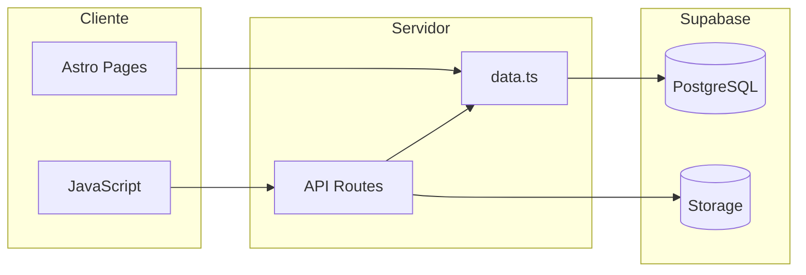
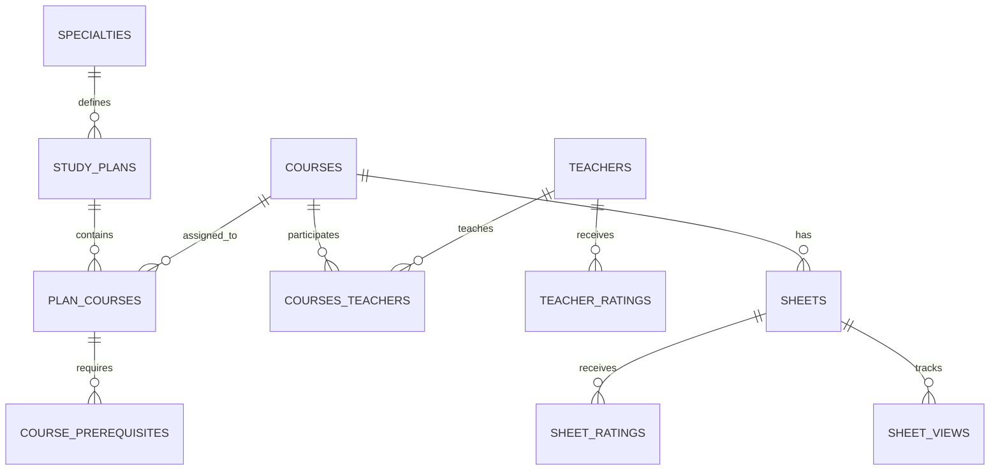
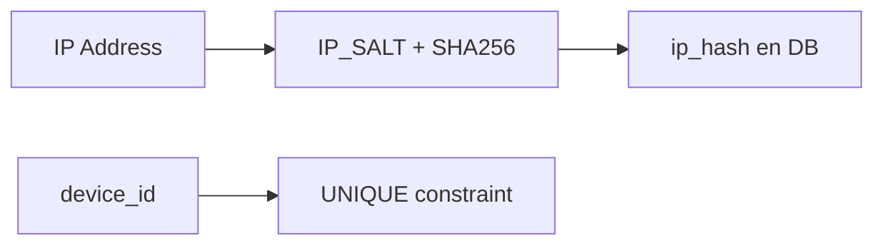

# Arquitectura del Proyecto

## Objetivo

TrikaWeb centraliza recursos académicos (planchas y solucionarios) y permite a
estudiantes calificar planchas y profesores con controles anti-spam.

## Stack Técnico

| Capa | Tecnología |
|------|------------|
| **Frontend** | Astro + Tailwind CSS |
| **Backend** | Astro API Routes (`src/pages/api`) |
| **Base de datos** | Supabase (PostgreSQL) |
| **Storage** | Supabase Storage (buckets) |
| **Deploy** | Vercel (`@astrojs/vercel` adapter) |

## Estructura del Proyecto

```
src/
├── components/      # UI reutilizable (Cards, Modals, SearchBar...)
│   └── Malla/       # Componentes React del módulo de mallas curriculares
│       ├── Curriculum.tsx         # Lienzo público (ReactFlow + panel lateral)
│       ├── CurriculumBuilder.tsx  # Constructor drag-and-drop para admin
│       ├── CourseNode.tsx         # Nodo visual de curso en la malla
│       ├── CycleHeaderNode.tsx    # Nodo decorativo de encabezado de ciclo
│       └── CourseDetailPanel.tsx  # Panel lateral de detalles del curso
├── layouts/         # Layout base de páginas
├── lib/             # Lógica de acceso a datos y utilidades
│   ├── data.ts              # Funciones de consulta (getCourses, searchEntities...)
│   ├── curriculumTypes.ts   # Interfaces TypeScript del módulo de mallas
│   ├── supabase.client.ts   # Cliente público de Supabase
│   └── supabase.admin.ts    # Cliente admin (Service Key)
├── pages/
│   ├── admin/       # Vistas de administración
│   │   ├── mallas.astro              # CRUD de planes de estudio
│   │   └── mallas/builder/[id].astro # Constructor visual por plan
│   ├── api/         # Endpoints HTTP (ver api.md)
│   │   └── admin/
│   │       ├── add-malla.ts     # Crear plan de estudios
│   │       ├── edit-malla.ts    # Editar metadatos del plan
│   │       ├── delete-malla.ts  # Eliminar plan
│   │       ├── toggle-malla.ts  # Publicar/despublicar plan
│   │       ├── save-malla.ts    # Persistir cursos + prerrequisitos del builder
│   │       └── mallas.ts        # Listar planes paginados
│   ├── curso/       # Rutas dinámicas /curso/[code]
│   ├── especialidades/   # Mallas curriculares públicas
│   │   ├── index.astro   # Catálogo agrupado por carrera
│   │   └── [id].astro    # Vista interactiva de malla
│   ├── exams/       # Detalle de planchas /exams/[id]
│   └── profesores/  # Listado y detalle de profesores
└── styles/          # Estilos globales

supabase/
├── schema.sql              # Definición de tablas
├── function_triggers.sql   # Triggers para métricas derivadas
└── migrations/             # Migraciones incrementales
```

## Arquitectura Frontend (Módulo Mallas)

### Jerarquía de Componentes Principales

```
[id].astro (página Astro, SSR)
└── <Curriculum /> (React, client:load)
    ├── <ReactFlowProvider>
    │   └── <CurriculumInner>
    │       ├── <CourseDetailPanel /> (panel lateral)
    │       ├── <ReactFlow>
    │       │   ├── <CourseNode /> (nodo personalizado)
    │       │   └── <CycleHeaderNode /> (nodo decorativo)
    │       └── Controles flotantes (zoom, reset, fullscreen)
    └── Datos inyectados desde Astro → props.data: CurriculumData
```

### Tipado Central (`curriculumTypes.ts`)

| Interface | Propósito |
|-----------|-----------|
| `CurriculumCourse` | Curso con ciclo, créditos, sumilla, dificultad y docentes |
| `CoursePrerequisite` | Relación `course_id → prerequisite_id` |
| `CurriculumData` | Payload completo que el servidor inyecta al componente React |

## Diagramas de Flujo

Para diagramas visuales detallados, ver [`flujos.md`](flujos.md):
- Arquitectura general del sistema
- Flujo de consultas y calificaciones
- Modelo de datos (ER)
- Sistema anti-spam

## Flujo de Datos


```mermaid
flowchart LR
    subgraph Cliente
        UI[Astro Pages]
        JS[JavaScript]
    end
    
    subgraph Servidor
        API[API Routes]
        DATA[data.ts]
    end
    
    subgraph Supabase
        DB[(PostgreSQL)]
        STORE[(Storage)]
    end
    
    UI --> DATA
    JS --> API
    API --> DATA
    DATA --> DB
    API --> STORE
```

1. **Frontend** consulta datos vía `src/lib/data.ts` (cliente público de Supabase).
2. **Operaciones sensibles** (subida de archivos, ratings, moderación) pasan por API.
3. **Endpoints admin** usan `supabaseAdmin` (Service Key) y validación de sesión.
4. **Archivos PDF** se guardan en buckets `exams` y `solutions`.

## Modelo de Datos

### Tablas Principales

| Tabla | Descripción |
|-------|-------------|
| `courses` | Cursos (`code`, `name`, `credits`) |
| `teachers` | Docentes (`full_name`, `bio`, `avg_overall`, `is_hidden`) |
| `courses_teachers` | Relación N:M cursos ↔ docentes |
| `sheets` | Planchas y solucionarios (metadata + paths) |
| `sheet_ratings` | Votos de dificultad por plancha |
| `sheet_views` | Eventos de vista/descarga |
| `teacher_ratings` | Calificaciones de profesores |
| `write_limits` | Control de rate-limit por IP |
| `specialties` | Carreras/especialidades (`name`) |
| `study_plans` | Planes de estudio por especialidad (`year`, `is_current`, `is_published`, `specialty_id`) |
| `plan_courses` | Cursos asignados a un plan con posición en la malla (`plan_id`, `course_id`, `cycle`, `row_index`) |
| `course_prerequisites` | Prerrequisitos entre cursos dentro de un plan (`plan_id`, `course_id`, `prerequisite_id`) |

### Diagrama ER

Ver diagrama completo en [`flujos.md#modelo-de-datos-er-simplificado`](flujos.md#modelo-de-datos-er-simplificado).


```mermaid
erDiagram
    COURSES ||--o{ SHEETS : has
    COURSES ||--o{ COURSES_TEACHERS : participates
    TEACHERS ||--o{ COURSES_TEACHERS : teaches
    TEACHERS ||--o{ TEACHER_RATINGS : receives
    SHEETS ||--o{ SHEET_RATINGS : receives
    SHEETS ||--o{ SHEET_VIEWS : tracks
    SPECIALTIES ||--o{ STUDY_PLANS : defines
    STUDY_PLANS ||--o{ PLAN_COURSES : contains
    COURSES ||--o{ PLAN_COURSES : assigned_to
    PLAN_COURSES ||--o{ COURSE_PREREQUISITES : requires
```

## Triggers y Cálculos Derivados

Definidos en `supabase/function_triggers.sql`:

| Trigger | Tabla origen | Efecto |
|---------|--------------|--------|
| `refresh_sheet_stats` | `sheet_ratings` | Recalcula `avg_difficulty` y `rating_count` en `sheets` |
| `refresh_view_count` | `sheet_views` | Recalcula `view_count` en `sheets` |
| `refresh_teacher_stats` | `teacher_ratings` | Recalcula `avg_overall` y `rating_count` en `teachers` |

## Seguridad

### Identificación de Usuarios


```mermaid
flowchart LR
    IP[IP Address] --> HASH["IP_SALT + SHA256"]
    HASH --> STORED[ip_hash en DB]
    DEVICE[device_id] --> UNIQUE["UNIQUE constraint"]
```

- **`ip_hash`**: IP hasheada con `IP_SALT` (nunca se guarda IP en claro).
- **`device_id`**: UUID generado en cliente para limitar votos duplicados.
- **Rate limiting**: Tabla `write_limits` por IP en endpoints de escritura.

### Autenticación Admin

- Cookie de sesión (`admin_session`) validada con Supabase Auth.
- Service key (`SUPABASE_SERVICE_KEY`) solo en servidor.

## Storage Buckets

| Bucket | Contenido | Acceso |
|--------|-----------|--------|
| `exams` | PDFs de planchas | Signed URLs (tiempo limitado) |
| `solutions` | PDFs de solucionarios | Signed URLs |
| `thumbnails` | Miniaturas (opcional) | Público |

## Variables de Entorno Críticas

| Variable | Uso |
|----------|-----|
| `SUPABASE_SERVICE_KEY` | Operaciones admin (nunca exponer en cliente) |
| `IP_SALT` | Hasheo de IPs para rate limiting |
| `ADMIN_PASS` | Validación de uploads |

Ver configuración completa en [`setup.md`](setup.md).
