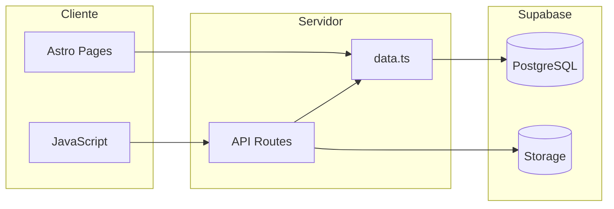
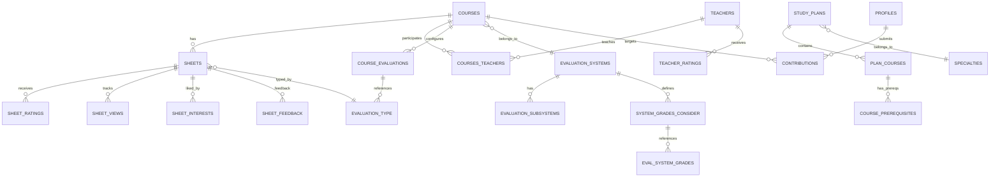
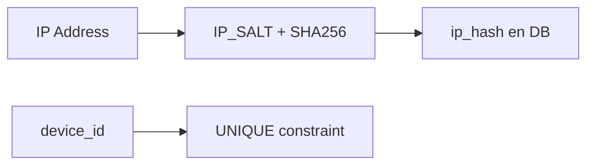

# Arquitectura del Proyecto

## Objetivo

TrikaWeb centraliza recursos académicos (planchas y solucionarios) y permite a
estudiantes calificar planchas y profesores con controles anti-spam.

## Stack Técnico

| Capa | Tecnología |
|------|------------|
| **Frontend** | Astro + Tailwind CSS |
| **Backend** | Astro API Routes (`src/pages/api`) |
| **Base de datos** | Supabase (PostgreSQL) |
| **Storage** | Supabase Storage (buckets) |
| **Deploy** | Vercel (`@astrojs/vercel` adapter) |

## Estructura del Proyecto

```
src/
├── components/      # UI reutilizable (Cards, Modals, SearchBar...)
├── layouts/         # Layout base de páginas
├── lib/             # Lógica de acceso a datos y utilidades
│   ├── data.ts      # Funciones de consulta (getCourses, searchEntities...)
│   ├── supabase.client.ts   # Cliente público de Supabase
│   └── supabase.admin.ts    # Cliente admin (Service Key)
├── pages/
│   ├── admin/       # Vistas de administración
│   ├── api/         # Endpoints HTTP (ver api.md)
│   ├── curso/       # Rutas dinámicas /curso/[code]
│   ├── exams/       # Detalle de planchas /exams/[id]
│   └── profesores/  # Listado y detalle de profesores
└── styles/          # Estilos globales

supabase/
├── schema.sql              # Definición de tablas
├── function_triggers.sql   # Triggers para métricas derivadas
└── migrations/             # Migraciones incrementales
```

## Diagramas de Flujo

Para diagramas visuales detallados, ver [`flujos.md`](flujos.md):
- Arquitectura general del sistema
- Flujo de consultas y calificaciones
- Modelo de datos (ER)
- Sistema anti-spam

## Flujo de Datos


```mermaid
flowchart LR
    subgraph Cliente
        UI[Astro Pages]
        JS[JavaScript]
    end
    
    subgraph Servidor
        API[API Routes]
        DATA[data.ts]
    end
    
    subgraph Supabase
        DB[(PostgreSQL)]
        STORE[(Storage)]
    end
    
    UI --> DATA
    JS --> API
    API --> DATA
    DATA --> DB
    API --> STORE
```

1. **Frontend** consulta datos vía `src/lib/data.ts` (cliente público de Supabase).
2. **Operaciones sensibles** (subida de archivos, ratings, moderación) pasan por API.
3. **Endpoints admin** usan `supabaseAdmin` (Service Key) y validación de sesión.
4. **Archivos PDF** se guardan en buckets `exams` y `solutions`.

## Modelo de Datos

### Tablas Principales

| Tabla | Descripción |
|-------|-------------|
| `courses` | Cursos (código, nombre, créditos, sistema eval, plan de estudios) |
| `teachers` | Docentes (nombre, bio, stats, visibilidad) |
| `courses_teachers` | Relación N:M cursos ↔ docentes con modalidad |
| `sheets` | Planchas y solucionarios (metadata + paths) |
| `sheet_ratings` | Votos de dificultad por plancha |
| `sheet_views` | Eventos de vista/descarga |
| `sheet_interests` | Interés/megusta en planchas (toggle por device_id) |
| `sheet_feedback` | Comentarios y feedback directo en planchas |
| `teacher_ratings` | Calificaciones multidimensionales de profesores |
| `contributions` | Solicitudes de contribución de usuarios externos |

### Tablas de Sistema de Evaluación

| Tabla | Descripción |
|-------|-------------|
| `evaluation_systems` | Sistemas de evaluación (régimen de notas) |
| `evaluation_subsystems` | Subsistemas (ej: práctica calificada) |
| `evaluation_type` | Tipos de evaluación (PC1, PC2, EP, EF, etc.) |
| `course_evaluations` | Evaluaciones asociadas a cada curso |
| `eval_system_grades` | Rangos de notas por sistema |
| `system_grades_consider` | Pesos de notas dentro de un sistema |
| `grade_evaluation_type` | Relación rango ↔ tipo de evaluación |

### Tablas de Plan de Estudios

| Tabla | Descripción |
|-------|-------------|
| `study_plans` | Planes de estudio por especialidad |
| `specialties` | Especialidades/carreras |
| `plan_courses` | Cursos que pertenecen a un plan (con ciclo) |
| `course_prerequisites` | Prerrequisitos entre cursos |

### Tablas de Usuarios

| Tabla | Descripción |
|-------|-------------|
| `profiles` | Perfiles de usuario vinculados a Supabase Auth. Rol: `student` o `admin` (enum `user_role`) |
| `cycles` | Ciclos/cuatrimestres académicos |

### Tablas de Seguridad

| Tabla | Descripción |
|-------|-------------|
| `write_limits` | Control de rate-limit por IP hasheada |

### Diagrama ER

Ver diagrama completo en [`flujos.md#modelo-de-datos-er-simplificado`](flujos.md#modelo-de-datos-er-simplificado).


```mermaid
erDiagram
    COURSES ||--o{ SHEETS : has
    COURSES ||--o{ COURSES_TEACHERS : participates
    COURSES ||--o{ COURSE_EVALUATIONS : configures
    COURSE_EVALUATIONS ||--o{ EVALUATION_TYPE : references
    COURSES }o--|| EVALUATION_SYSTEMS : belongs_to
    EVALUATION_SYSTEMS ||--o{ EVALUATION_SUBSYSTEMS : has
    EVALUATION_SYSTEMS ||--o{ SYSTEM_GRADES_CONSIDER : defines
    SYSTEM_GRADES_CONSIDER ||--o{ EVAL_SYSTEM_GRADES : references
    TEACHERS ||--o{ COURSES_TEACHERS : teaches
    TEACHERS ||--o{ TEACHER_RATINGS : receives
    SHEETS ||--o{ SHEET_RATINGS : receives
    SHEETS ||--o{ SHEET_VIEWS : tracks
    SHEETS ||--o{ SHEET_INTERESTS : liked_by
    SHEETS ||--o{ SHEET_FEEDBACK : feedback
    SHEETS }o--|| EVALUATION_TYPE : typed_by
    STUDY_PLANS ||--o{ PLAN_COURSES : contains
    STUDY_PLANS }o--|| SPECIALTIES : belongs_to
    PLAN_COURSES ||--o{ COURSE_PREREQUISITES : has_prereqs
    PROFILES ||--o{ CONTRIBUTIONS : submits
    COURSES ||--o{ CONTRIBUTIONS : targets
```

## Triggers y Cálculos Derivados

Definidos en `supabase/function_triggers.sql`:

| Trigger | Tabla origen | Efecto |
|---------|--------------|--------|
| `refresh_sheet_stats` | `sheet_ratings` | Recalcula `avg_difficulty` y `rating_count` en `sheets` |
| `refresh_view_count` | `sheet_views` | Recalcula `view_count` en `sheets` |
| `refresh_teacher_stats` | `teacher_ratings` | Recalcula `avg_overall` y `rating_count` en `teachers` |

> Nota: La columna `interest_count` en `sheets` se actualiza desde el backend (API) al hacer toggle de interés, no vía trigger. El contador es eventualmente consistente y se recalcula en cada toggle.

## RPC Functions (Stored Procedures)

Funciones almacenadas en PostgreSQL, invocadas desde la API del panel admin:

| Función | Propósito |
|---------|-----------|
| `create_course_with_evaluations` | Crea un curso validando sistema/subsistema de evaluación y asociando evaluaciones correspondientes |
| `get_evaluation_systems` | Lista todos los sistemas de evaluación (`system_cod`, `system_description`, `requires_subsystem`) |
| `get_evaluation_subsystems` | Lista subsistemas de evaluación ordenados por cantidad de prácticas |
| `get_variable_evaluations_by_system(p_system_id)` | Obtiene evaluaciones variables (prácticas, laboratorios, trabajos) para un sistema dado |
| `get_average_stars(p_sheet_id)` | Calcula promedio de estrellas visibles en `sheet_feedback` |
| `handle_new_user` | Trigger de Auth: crea `profiles` automáticamente al registrarse un nuevo usuario |

### Triggers que ejecutan funciones

| Trigger | Función | Evento | Efecto |
|---------|---------|--------|--------|
| `t_sheet_ratings_stats` | `refresh_sheet_stats` | AFTER INSERT/UPDATE/DELETE ON `sheet_ratings` | Recalcula `avg_difficulty` y `rating_count` en `sheets` |
| `t_sheet_views_stats` | `refresh_view_count` | AFTER INSERT ON `sheet_views` | Recalcula `view_count` en `sheets` |
| `t_teacher_ratings_stats` | `refresh_teacher_stats` | AFTER INSERT/UPDATE/DELETE ON `teacher_ratings` | Recalcula `avg_overall` y `rating_count` en `teachers` |
| `set_updated_at` | `set_updated_at` | BEFORE UPDATE ON `teacher_ratings` | Actualiza automáticamente `updated_at` |

## Seguridad

### Identificación de Usuarios


```mermaid
flowchart LR
    IP[IP Address] --> HASH["IP_SALT + SHA256"]
    HASH --> STORED[ip_hash en DB]
    DEVICE[device_id] --> UNIQUE["UNIQUE constraint"]
```

- **`ip_hash`**: IP hasheada con `IP_SALT` (nunca se guarda IP en claro).
- **`device_id`**: UUID generado en cliente para limitar votos duplicados.
- **Rate limiting**: Tabla `write_limits` por IP en endpoints de escritura.

### Autenticación Admin

- Cookie de sesión (`admin_session`) validada con Supabase Auth.
- Service key (`SUPABASE_SERVICE_KEY`) solo en servidor.

### Row Level Security (RLS)

Políticas de seguridad a nivel de fila en Supabase:

| Tabla | Política | Comando | Roles | Comportamiento |
|-------|----------|---------|-------|----------------|
| `courses` | `public read courses` | SELECT | public | Lectura pública |
| `courses_teachers` | `public read courses_teachers` | SELECT | public | Lectura pública |
| `teachers` | `public read visible teachers` | SELECT | public | Solo `is_hidden = false` |
| `sheets` | `public read sheets` | SELECT | public | Lectura pública |
| `sheet_ratings` | `public read sheet_ratings` | SELECT | public | Lectura pública |
| `sheet_views` | `public read sheet_views` | SELECT | public | Lectura pública |
| `sheet_interests` | `public read sheet_interests` | SELECT | public | Lectura pública |
| `sheet_interests` | `allow insert sheet_interests` | INSERT | public | Inserción permitida |
| `sheet_interests` | `allow delete sheet_interests` | DELETE | public | Eliminación permitida |
| `sheet_feedback` | `Public can read visible sheet feedback` | SELECT | public | Solo `is_hidden = false` |
| `sheet_feedback` | `Public can insert sheet feedback` | INSERT | public | Inserción permitida |
| `teacher_ratings` | `public read teacher_ratings` | SELECT | public | Lectura pública |
| `contributions` | `contributions_select_approved` | SELECT | public | Solo `status = 'approved'` |
| `contributions` | `contributions_select_own` | SELECT | public | Solo propias (por `user_id` o `user_email`) |
| `contributions` | `contributions_insert_own` | INSERT | public | Inserción permitida |
| `profiles` | `profiles_select_own` | SELECT | public | Solo propio (`auth.uid() = id`) |
| `profiles` | `profiles_insert_own` | INSERT | public | Solo propio |
| `profiles` | `profiles_update_own` | UPDATE | public | Solo propio |
| `evaluation_systems` | `public read evaluation_systems` | SELECT | public | Lectura pública |
| `evaluation_subsystems` | `public read evaluation_subsystems` | SELECT | public | Lectura pública |
| `eval_system_grades` | `public read eval_system_grades` | SELECT | public | Lectura pública |
| `system_grades_consider` | `Allow read for all` | SELECT | public | Lectura pública |
| `cycles` | `Allow read cycles` | SELECT | anon, authenticated | Lectura pública |
| `study_plans` | `Planes de estudio visibles para todos` | SELECT | public | Lectura pública |
| `study_plans` | `Permitir todo a usuarios logueados` | ALL | authenticated | Acceso total |
| `specialties` | `Especialidades visibles para todos` | SELECT | public | Lectura pública |
| `plan_courses` | `Cursos de plan visibles para todos` | SELECT | public | Lectura pública |
| `plan_courses` | `Permitir todo a usuarios logueados` | ALL | authenticated | Acceso total |
| `course_prerequisites` | `Prerequisitos visibles para todos` | SELECT | public | Lectura pública |
| `course_prerequisites` | `Permitir todo a usuarios logueados` | ALL | authenticated | Acceso total |

> Nota: Las inserciones en `sheet_ratings`, `teacher_ratings`, `sheet_views` y `write_limits` se realizan desde el backend con la **Service Key** y no pasan por RLS pública. Los GRANTs en `schema.sql` son necesarios para que el rol `anon` pueda escribir via `supabaseAdmin`.

## Storage Buckets

| Bucket | Contenido | Acceso | Límite | MIME types |
|--------|-----------|--------|--------|------------|
| `exams` | PDFs de planchas | Privado (signed URLs) | — | — |
| `solutions` | PDFs de solucionarios | Privado (signed URLs) | — | — |
| `thumbnails` | Miniaturas de preview | Público | — | `image/jpeg, image/png` |
| `avatars` | Avatares de profesores/usuarios | Público | — | `image/jpeg, image/png, image/webp` |
| `contributions` | Archivos subidos por contribuciones de usuarios | Privado | 10 MB | — |

## Variables de Entorno Críticas

| Variable | Uso |
|----------|-----|
| `SUPABASE_SERVICE_KEY` | Operaciones admin (nunca exponer en cliente) |
| `IP_SALT` | Hasheo de IPs para rate limiting |
| `ADMIN_PASS` | Validación de uploads |

Ver configuración completa en [`setup.md`](setup.md).
