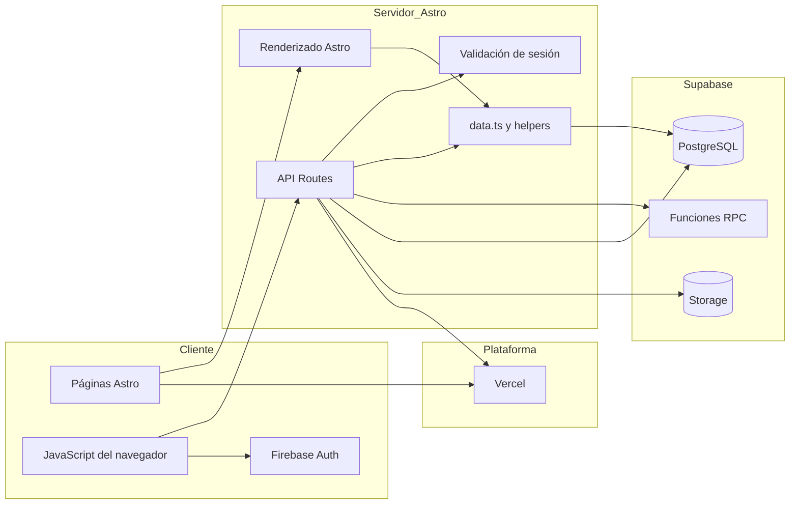
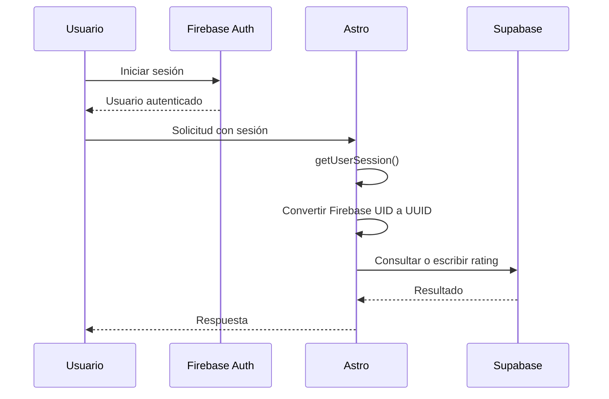
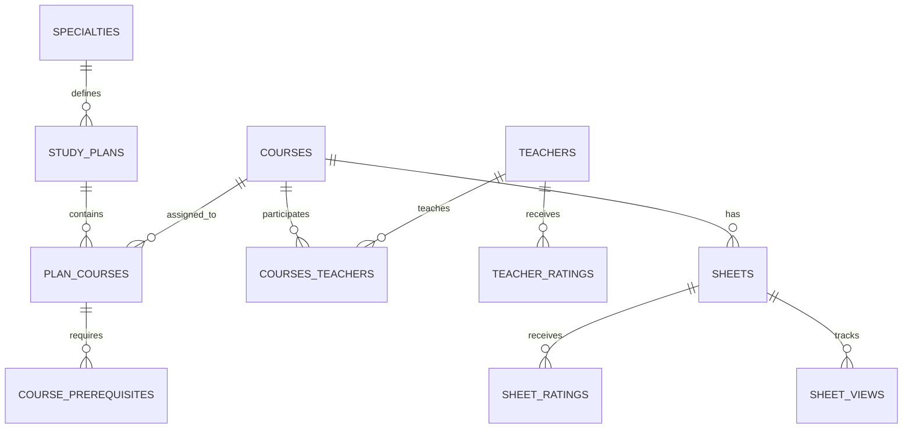
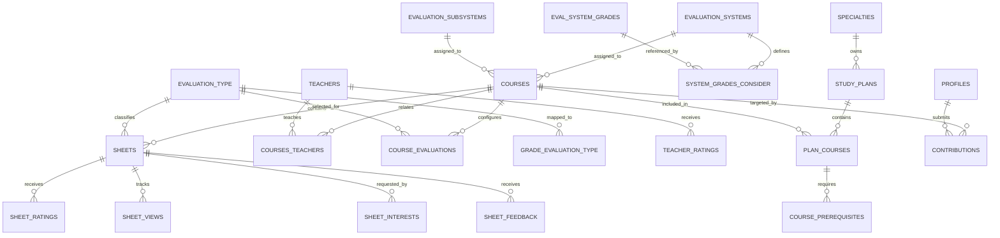
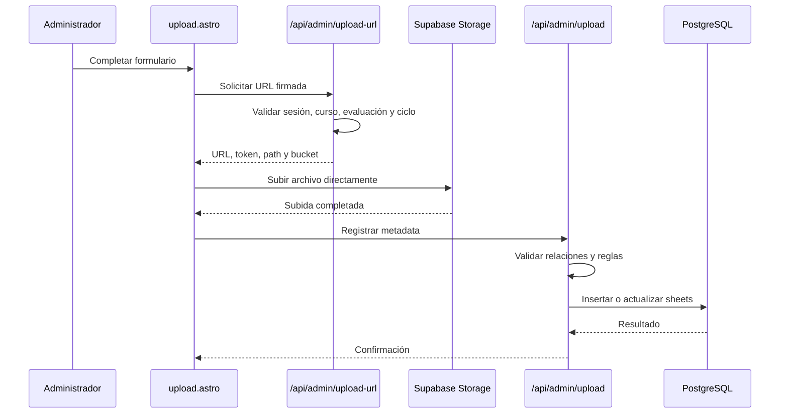
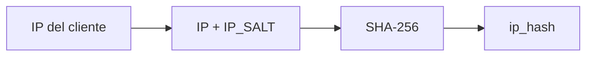

# Arquitectura del Proyecto

## Objetivo

TrikaWeb centraliza recursos académicos, principalmente planchas y solucionarios,
y ofrece funcionalidades para:

- Buscar cursos, profesores y evaluaciones.
- Visualizar y descargar planchas.
- Consultar solucionarios en PDF o video.
- Calificar la dificultad de las planchas.
- Calificar profesores.
- Registrar interés en planchas que todavía no tienen solucionario.
- Administrar cursos, profesores, evaluaciones y archivos desde un panel privado.

La arquitectura separa las operaciones públicas de lectura de las operaciones
sensibles de escritura. Estas últimas se ejecutan mediante endpoints de servidor,
validaciones explícitas y el cliente administrativo de Supabase.

---

## Stack técnico

| Capa | Tecnología |
|---|---|
| **Frontend** | Astro + TypeScript + Tailwind CSS |
| **Islas React** | `@astrojs/react` + React 19 + `@xyflow/react` (mallas) |
| **Backend** | Astro API Routes (`src/pages/api`) |
| **Base de datos** | Supabase PostgreSQL |
| **Storage** | Supabase Storage |
| **Autenticación de estudiantes** | Firebase Authentication (cookie `firebase_session`, correos `@uni.pe`) |
| **Sesión administrativa** | Supabase Auth con cookie `admin_session` validada en el servidor |
| **Deploy** | Vercel mediante `@astrojs/vercel` (output `server`) |
| **Documentación** | Markdown + diagramas Mermaid |

---

## Estructura del proyecto

```text
src/
├── assets/                     # Recursos estáticos (imágenes, favicon...)
├── components/                 # UI reutilizable (Astro y React)
│   ├── Malla/                  # Componentes React del módulo de mallas curriculares
│   │   ├── Curriculum.tsx         # Lienzo público (ReactFlow + panel lateral)
│   │   ├── CurriculumBuilder.tsx  # Constructor drag-and-drop para admin
│   │   ├── CourseNode.tsx         # Nodo visual de curso en la malla
│   │   ├── CycleHeaderNode.tsx    # Nodo decorativo de encabezado de ciclo
│   │   └── CourseDetailPanel.tsx  # Panel lateral de detalles del curso
│   ├── icons/                       # Iconos SVG en Astro
│   │   ├── IconChevronDown.astro
│   │   ├── IconHome.astro
│   │   ├── IconSearch.astro
│   │   └── IconStar.astro
│   ├── AdminHeader.astro
│   ├── CardExam.astro
│   ├── ContainerCardExam.astro
│   ├── DownloadButton.astro
│   ├── IntroductionOfTeachers.astro
│   ├── ModalConfirm.astro
│   ├── PageSubHeader.astro
│   ├── SearchAutocomplete.astro
│   ├── SheetRating.astro
│   ├── SiteHeader.astro
│   ├── TeacherAvatar.astro
│   ├── TeacherCard.astro
│   └── TeacherRatingForm.astro
├── layouts/                     # Layout base de páginas
│   └── Layout.astro
├── lib/                         # Lógica de acceso a datos y utilidades
│   ├── data.ts                     # Consultas públicas (getCourses, searchEntities, getTeacherDetail...)
│   ├── curriculumTypes.ts          # Interfaces TypeScript del módulo de mallas
│   ├── supabase.client.ts          # Cliente público de Supabase (anon key)
│   ├── supabaseAdmin.ts            # Cliente administrativo (Service Key, omite RLS)
│   ├── adminAuth.ts                # Validación de la sesión administrativa
│   ├── adminUploadPaths.ts         # Construcción de rutas de Storage para subidas
│   ├── adminUploadStorage.ts       # Verificación y promoción de objetos en Storage
│   ├── auth.ts                     # Sesión de estudiantes (Firebase) y getUserSession
│   ├── authConstants.ts            # Constantes de autenticación (sufijo @uni.pe)
│   ├── firebase-admin.ts           # Inicialización/verificación del Admin SDK de Firebase
│   ├── sessionCookies.ts           # Helpers de cookies de sesión
│   ├── favorites.ts                # Favoritos en localStorage
│   ├── urlUtils.ts                 # Utilitarios de URLs
│   ├── utils.ts                    # Hashing de IP, rate limiting, getUuidFromFirebaseUid...
│   ├── client/                     # Lógica de cliente
│   │   ├── device.ts               # device_id persistido en localStorage
│   │   └── favorites.ts
│   └── server/
│       └── getVisibleSheet.ts      # Consulta centralizada de planchas visibles
├── middleware.ts                # Protección SSR de rutas /admin (cookie admin_session)
├── pages/                       # Páginas Astro y endpoints HTTP
│   ├── admin/                           # Vistas de administración (protegidas)
│   │   ├── mallas.astro                # CRUD de planes de estudio (client:load)
│   │   ├── mallas/builder/[id].astro   # Constructor visual por plan
│   │   ├── courses.astro               # Listado/gestión de cursos
│   │   ├── courses/[id]/edit.astro     # Edición de un curso
│   │   ├── teachers.astro
│   │   ├── sheets.astro                   # Gestión de planchas
│   │   ├── upload.astro          # Panel de subida
│   │   ├── contributions.astro  # Revisión de contribuciones
│   │   ├── ratings.astro   # Gestión de calificaciones
│   │   ├── moderation.astro  # Moderación de comentarios
│   │   └── login.astro               # Inicio de sesión admin
│   ├── api/                        # Endpoints HTTP (ver api.md)
│   │   ├── search.ts                 # Búsqueda global
│   │   ├── admin/                  # Endpoints administrativos protegidos
│   │   │   ├── login.ts                # POST /api/admin/login
│   │   │   ├── logout.ts              # POST /api/admin/logout
│   │   │   ├── courses.ts             # Lista cursos (POST)
│   │   │   ├── add-course.ts          # Crear curso
│   │   │   ├── update-course.ts       # PATCH actualizar curso
│   │   │   ├── delete-course.ts       # Eliminar curso
│   │   │   ├── toggle-course.ts       # Ocultar/mostrar curso
│   │   │   ├── course-details.ts     # Detalle para edición
│   │   │   ├── course-options.ts     # Opciones de cursos para selects
│   │   │   ├── course-evaluations.ts # Evaluaciones de un curso
│   │   │   ├── course-evaluation-options.ts # Evaluaciones variables por sistema
│   │   │   ├── cycles.ts             # Ciclos académicos
│   │   │   ├── evaluation-systems.ts
│   │   │   ├── evaluation-subsystems.ts
│   │   │   ├── teachers.ts
│   │   │   ├── add-teacher.ts
│   │   │   ├── delete-teacher.ts
│   │   │   ├── toggle-teacher.ts
│   │   │   ├── sheets.ts             # Lista planchas (POST)
│   │   │   ├── upload.ts             # Registrar metadata de subida
│   │   │   ├── upload-url.ts         # URL firmada para subir a Storage
│   │   │   ├── delete-sheet.ts
│   │   │   ├── toggle-sheet.ts
│   │   │   ├── all-ratings.ts
│   │   │   ├── delete-rating.ts
│   │   │   ├── approve-comment.ts
│   │   │   ├── hide-comment.ts
│   │   │   ├── pending-comments.ts
│   │   │   ├── reset-interest.ts
│   │   │   ├── drive-sync.ts
│   │   │   ├── mallas.ts             # Listar planes (POST)
│   │   │   ├── add-malla.ts
│   │   │   ├── edit-malla.ts
│   │   │   ├── delete-malla.ts
│   │   │   ├── toggle-malla.ts
│   │   │   ├── save-malla.ts
│   │   │   └── contributions/
│   │   │       ├── list.ts          # GET /api/admin/contributions/list
│   │   │       └── review.ts        # POST /api/admin/contributions/review
│   │   ├── auth/                  # Autenticación de estudiantes (Firebase)
│   │   │   ├── login.ts
│   │   │   ├── register.ts
│   │   │   └── logout.ts
│   │   ├── contributions/         # Contribuciones de usuarios
│   │   │   ├── create.ts
│   │   │   ├── my-contributions.ts
│   │   │   └── clear-history.ts
│   │   ├── profile/               # Perfil y avatar
│   │   │   ├── update.ts
│   │   │   └── avatar.ts
│   │   ├── cursos/                  # Rutas de cursos
│   │   │   ├── index.ts                 # GET /api/cursos (autocompletado)
│   │   │   └── [cursoCode]/profesores.ts  # GET /api/cursos/:cursoCode/profesores
│   │   ├── profesores/            # Rutas de profesores
│   │   │   ├── [id]/detail.ts        # GET /api/profesores/:id/detail
│   │   │   └── [id]/rate.ts          # POST/GET/DELETE /api/profesores/:id/rate
│   │   └── sheets/                # Rutas de planchas
│   │       ├── batch.ts             # POST /api/sheets/batch
│   │       └── [id]/
│   │           ├── file.ts          # GET /api/sheets/:id/file
│   │           ├── interest.ts      # GET/POST /api/sheets/:id/interest
│   │           ├── rate.ts          # POST/GET/DELETE /api/sheets/:id/rate
│   │           ├── solution.ts      # GET /api/sheets/:id/solution
│   │           └── view.ts          # POST /api/sheets/:id/view
│   ├── curso/                      # Rutas dinámicas /curso/[code]
│   │   ├── [code].astro
│   │   └── [code]/profesores.astro
│   ├── especialidades/             # Mallas curriculares públicas
│   │   ├── index.astro            # Catálogo agrupado por carrera
│   │   └── [id].astro             # Vista interactiva de malla
│   ├── exams/                      # Detalle de planchas /exams/[id]
│   │   └── [id].astro
│   ├── profesores/                 # Detalle de profesores
│   │   └── [id].astro
│   ├── profile/                    # Perfiles de usuario
│   │   └── [id].astro
│   ├── cursos.astro                # Catálogo de cursos
│   ├── profesores.astro            # Catálogo de profesores
│   ├── login.astro                 # Login de estudiantes
│   ├── profile.astro               # Perfil propio
│   ├── saved.astro                 # Elementos guardados
│   ├── privacidad.astro
│   ├── terminos.astro
│   ├── sitemap.xml.ts
│   ├── index.astro                # Página principal
│   └── ...
├── scripts/                   # Scripts de cliente
│   └── profile-form.ts
└── styles/                      # Estilos globales
    └── global.css
```

## Arquitectura Frontend (Módulo Mallas)

### Jerarquía de Componentes Principales

```
[id].astro (página Astro, SSR)
└── <Curriculum /> (React, client:load)
    ├── <ReactFlowProvider>
    │   └── <CurriculumInner>
    │       ├── <CourseDetailPanel /> (panel lateral)
    │       ├── <ReactFlow>
    │       │   ├── <CourseNode /> (nodo personalizado)
    │       │   └── <CycleHeaderNode /> (nodo decorativo)
    │       └── Controles flotantes (zoom, reset, fullscreen)
    └── Datos inyectados desde Astro → props.data: CurriculumData
```

### Tipado Central (`curriculumTypes.ts`)

| Interface | Propósito |
|-----------|-----------|
| `CurriculumCourse` | Curso con ciclo, créditos, sumilla, dificultad y docentes |
| `CoursePrerequisite` | Relación `course_id → prerequisite_id` |
| `CurriculumData` | Payload completo que el servidor inyecta al componente React |

### Constructor administrativo

```
/admin/mallas/builder/[id].astro (página Astro, SSR)
└── <CurriculumBuilder /> (React, client:load)
    ├── Sidebar con buscador de cursos y tarjetas arrastrables
    ├── Cuadrícula 10 ciclos × 15 filas (grid drag-and-drop)
    ├── Gestión de prerrequisitos por curso posicionado
    └── Botón de guardado portaleado a #react-save-button-root
```

---

### Responsabilidades principales

- `src/pages`: páginas Astro y endpoints HTTP.
- `src/components`: componentes reutilizables de interfaz.
- `src/lib/data.ts`: consultas compartidas para páginas públicas.
- `src/lib/supabaseAdmin.ts`: cliente exclusivo del servidor con privilegios administrativos.
- `src/lib/supabase.client.ts`: cliente de Supabase utilizado donde corresponda una sesión o acceso no administrativo.
- `src/lib/auth.ts`: integración de autenticación de estudiantes.
- `src/lib/adminAuth.ts`: validación de la sesión administrativa.
- `src/lib/utils.ts`: hashing, IP del cliente, rate limiting y normalización de identificadores.
- `src/lib/server/getVisibleSheet.ts`: consulta centralizada de planchas visibles y validación del curso asociado.
- `supabase/migrations`: cambios incrementales y versionados del esquema.

---

## Vista general de la arquitectura


```mermaid
flowchart LR
    subgraph Cliente
        PAGE[Páginas Astro]
        CLIENT_JS[JavaScript del navegador]
        FIREBASE[Firebase Auth]
    end

    subgraph Servidor_Astro
        SSR[Renderizado Astro]
        API[API Routes]
        AUTH[Validación de sesión]
        DATA[data.ts y helpers]
    end

    subgraph Supabase
        DB[(PostgreSQL)]
        STORAGE[(Storage)]
        RPC[Funciones RPC]
    end

    subgraph Plataforma
        VERCEL[Vercel]
    end

    PAGE --> SSR
    CLIENT_JS --> API
    CLIENT_JS --> FIREBASE
    SSR --> DATA
    API --> AUTH
    API --> DATA
    API --> RPC
    DATA --> DB
    API --> DB
    API --> STORAGE
    PAGE --> VERCEL
    API --> VERCEL
```

---

## Flujo de datos

1. Las páginas públicas se renderizan con Astro y consultan información mediante
   funciones compartidas de `src/lib/data.ts` o helpers de servidor.
2. Las acciones del navegador llaman endpoints en `src/pages/api`.
3. Las operaciones sensibles utilizan `supabaseAdmin` exclusivamente en el servidor.
4. Las páginas y endpoints que exponen planchas validan que:
   - La plancha exista.
   - `sheets.is_hidden = false`.
   - El curso asociado exista.
   - `courses.is_hidden = false`.
5. Los archivos privados se entregan mediante URLs firmadas o streaming controlado.
6. Los contadores derivados se actualizan mediante triggers o funciones RPC.
7. El panel administrativo requiere una cookie `admin_session` válida.

---

Las tablas de alto nivel del sistema se resumen en la siguiente tabla; los detalles
y columnas completas están en [`db_schema.md`](../db_schema.md).

| Tabla | Descripción |
|-------|-------------|
| `courses` | Cursos (`code`, `name`, `summary`, `credits`, `subsystem_id`, `status`) |
| `teachers` | Docentes (`full_name`, `bio`, `avg_overall`, `is_hidden`) |
| `courses_teachers` | Relación N:M cursos ↔ docentes |
| `sheets` | Planchas y solucionarios (metadata + paths) |
| `sheet_ratings` | Votos de dificultad por plancha |
| `sheet_views` | Eventos de vista/descarga |
| `teacher_ratings` | Calificaciones de profesores |
| `write_limits` | Control de rate-limit por IP |
| `specialties` | Carreras/especialidades (`name`) |
| `study_plans` | Planes de estudio por especialidad (`year`, `is_current`, `is_published`, `specialty_id`) |
| `plan_courses` | Cursos asignados a un plan con posición en la malla (`plan_id`, `course_id`, `cycle`, `row_index`) |
| `course_prerequisites` | Prerrequisitos entre cursos dentro de un plan (`plan_id`, `course_id`, `prerequisite_id`) |

> Las columnas `study_plans.id`, `plan_id` y `specialty_id` son «source of truth» de
> `supabase/migrations/create_mallas_tables.sql`. A diferencia de `specialties` (serial),
> `study_plans.id` es `uuid` con `gen_random_uuid()` y las eliminaciones en cascada
> (`ON DELETE CASCADE`) se aplican sobre `plan_courses` y `course_prerequisites`.

## Autenticación e identidad

### Estudiantes

La autenticación de estudiantes se realiza con Firebase Authentication.


```mermaid
sequenceDiagram
    participant U as Usuario
    participant F as Firebase Auth
    participant A as Astro
    participant S as Supabase

    U->>F: Iniciar sesión
    F-->>U: Usuario autenticado
    U->>A: Solicitud con sesión
    A->>A: getUserSession()
    A->>A: Convertir Firebase UID a UUID
    A->>S: Consultar o escribir rating
    S-->>A: Resultado
    A-->>U: Respuesta
```

El flujo de autenticación de estudiantes usa Firebase Auth y una cookie de sesión
`firebase_session` (creada en `POST /api/auth/login`, ver `api.md`). La verificación la
realiza el servidor mediante `getFirebaseAdminAuth().verifySessionCookie`, y el correo
debe terminar en `@uni.pe` (constante en `authConstants.ts`).


```mermaid
erDiagram
    COURSES ||--o{ SHEETS : has
    COURSES ||--o{ COURSES_TEACHERS : participates
    TEACHERS ||--o{ COURSES_TEACHERS : teaches
    TEACHERS ||--o{ TEACHER_RATINGS : receives
    SHEETS ||--o{ SHEET_RATINGS : receives
    SHEETS ||--o{ SHEET_VIEWS : tracks
    SPECIALTIES ||--o{ STUDY_PLANS : defines
    STUDY_PLANS ||--o{ PLAN_COURSES : contains
    COURSES ||--o{ PLAN_COURSES : assigned_to
    PLAN_COURSES ||--o{ COURSE_PREREQUISITES : requires
```

Para tablas que almacenan `device_id` como UUID, el backend transforma el UID de
Firebase mediante `getUuidFromFirebaseUid`. De esta forma, el identificador no
depende de un UUID arbitrario enviado por el navegador.

La sesión de estudiante se establece mediante `POST /api/auth/login`: el navegador
envía el `idToken` de Firebase, el servidor lo verifica con el Admin SDK, exige que el
correo termine en `@uni.pe`, persiste/actualiza la fila en `student_details` y emite la
cookie `firebase_session` (HTTP-only, 5 días). `getUserSession` (en `src/lib/auth.ts`)
la valida en cada solicitud protegida. El registro directo (`/api/auth/register`) está
deshabilitado: solo se permite el ingreso con la cuenta institucional Google.

### Administradores

La administración utiliza una cookie `admin_session`.

```mermaid
flowchart LR
    ADMIN[Administrador] --> LOGIN[/api/admin/login]
    LOGIN --> COOKIE[Cookie admin_session]
    COOKIE --> VALIDATE[validateAdminSession]
    VALIDATE -->|válida| ADMIN_API[Endpoints administrativos]
    VALIDATE -->|inválida| DENY[401 o redirección a /admin/login]
```

Las páginas y endpoints administrativos llaman `validateAdminSession` antes de
ejecutar consultas o modificaciones.

---

## Modelo de datos

### Tablas principales

| Tabla | Descripción |
|---|---|
| `courses` | Cursos: `code`, `name`, `summary`, `credits`, sistema/subsistema, `status` e `is_hidden` |
| `teachers` | Profesores: nombre, biografía, estadísticas e `is_hidden` |
| `courses_teachers` | Relación N:M entre cursos y profesores |
| `sheets` | Planchas y solucionarios, evaluación, ciclo, profesor, rutas de Storage y métricas |
| `sheet_ratings` | Calificaciones de dificultad por usuario y plancha |
| `sheet_views` | Registro de vistas o descargas |
| `sheet_interests` | Interés en solucionarios, único por `sheet_id` y `device_id` |
| `sheet_feedback` | Comentarios o feedback asociado a planchas |
| `teacher_ratings` | Calificaciones multidimensionales de profesores |
| `contributions` | Solicitudes de contribución realizadas por usuarios |

### Configuración de evaluaciones

| Tabla | Descripción |
|---|---|
| `evaluation_systems` | Sistemas o fórmulas de evaluación |
| `evaluation_subsystems` | Subsistemas asociados a prácticas, laboratorios o trabajos |
| `evaluation_type` | Tipos de evaluación: prácticas, parcial, final, trabajo, etc. |
| `course_evaluations` | Evaluaciones habilitadas para cada curso |
| `eval_system_grades` | Componentes o rangos del sistema |
| `system_grades_consider` | Pesos utilizados por cada sistema |
| `grade_evaluation_type` | Relación entre componentes y tipos de evaluación |
| `cycles` | Ciclos académicos con código, año y término |

### Planes de estudio

| Tabla | Descripción |
|---|---|
| `specialties` | Especialidades o carreras (`id` serial, `name`, `code`) |
| `study_plans` | Planes de estudio (`id` uuid, `specialty_id`, `year`, `is_current`, `is_published`) |
| `plan_courses` | Cursos incluidos en un plan con posición (`plan_id`, `course_id`, `cycle`, `row_index`) |
| `course_prerequisites` | Prerrequisitos entre cursos del plan (`plan_id`, `course_id`, `prerequisite_id`) |

Las escrituras sobre `study_plans`, `plan_courses` y `course_prerequisites` se realizan
mediante las funciones RPC `add_malla_transaction`, `edit_malla_transaction` y
`save_malla_transaction` (`SECURITY DEFINER`, ejecutables solo por `service_role`), ya que
el esquema deja las políticas de escritura deshabilitadas para `anon`/`authenticated`.
La lectura pública está habilitada mediante políticas `FOR SELECT` (solo se muestran
planes publicados desde la aplicación).

### Seguridad y control

| Tabla | Descripción |
|---|---|
| `write_limits` | Ventanas de rate limiting por IP hasheada |
| `profiles` | Metadatos de perfil y rol de aplicación, cuando corresponda |
| `student_details` | Datos de estudiantes (`user_id`, `email`, `full_name`, `specialty`, `avatar_url`) |
| `contributions` | Contribuciones de usuarios y su estado de revisión |

---

## Diagrama ER simplificado


```mermaid
erDiagram
    COURSES ||--o{ SHEETS : contains
    COURSES ||--o{ COURSES_TEACHERS : relates
    TEACHERS ||--o{ COURSES_TEACHERS : teaches

    COURSES ||--o{ COURSE_EVALUATIONS : configures
    EVALUATION_TYPE ||--o{ COURSE_EVALUATIONS : selected_for
    EVALUATION_SYSTEMS ||--o{ COURSES : assigned_to
    EVALUATION_SUBSYSTEMS ||--o{ COURSES : assigned_to

    EVALUATION_SYSTEMS ||--o{ SYSTEM_GRADES_CONSIDER : defines
    EVAL_SYSTEM_GRADES ||--o{ SYSTEM_GRADES_CONSIDER : referenced_by
    EVALUATION_TYPE ||--o{ GRADE_EVALUATION_TYPE : mapped_to

    TEACHERS ||--o{ TEACHER_RATINGS : receives
    SHEETS ||--o{ SHEET_RATINGS : receives
    SHEETS ||--o{ SHEET_VIEWS : tracks
    SHEETS ||--o{ SHEET_INTERESTS : requested_by
    SHEETS ||--o{ SHEET_FEEDBACK : receives
    EVALUATION_TYPE ||--o{ SHEETS : classifies

    SPECIALTIES ||--o{ STUDY_PLANS : owns
    STUDY_PLANS ||--o{ PLAN_COURSES : contains
    COURSES ||--o{ PLAN_COURSES : included_in
    PLAN_COURSES ||--o{ COURSE_PREREQUISITES : requires

    COURSES ||--o{ CONTRIBUTIONS : targeted_by
    PROFILES ||--o{ CONTRIBUTIONS : submits
```

---

## Estados de cursos

Los cursos utilizan:

- `INCOMPLETO`
- `COMPLETO`
- `ARCHIVADO`

Un curso puede mantenerse como `INCOMPLETO` cuando falta información necesaria,
por ejemplo:

- Sumilla.
- Subsistema requerido.
- Cantidad correcta de evaluaciones variables.
- Configuración académica coherente.

La subida de planchas y solucionarios se bloquea para cursos incompletos.

---

## Flujo de subida de archivos

La subida se divide en dos etapas para evitar el límite de tamaño de las
funciones de Vercel.


```mermaid
sequenceDiagram
    participant A as Administrador
    participant UI as upload.astro
    participant URL as /api/admin/upload-url
    participant ST as Supabase Storage
    participant META as /api/admin/upload
    participant DB as PostgreSQL

    A->>UI: Completar formulario
    UI->>URL: Solicitar URL firmada
    URL->>URL: Validar sesión, curso, evaluación y ciclo
    URL-->>UI: URL, token, path y bucket
    UI->>ST: Subir archivo directamente
    ST-->>UI: Subida completada
    UI->>META: Registrar metadata
    META->>META: Validar relaciones y reglas
    META->>DB: Insertar o actualizar sheets
    DB-->>META: Resultado
    META-->>UI: Confirmación
```

### Tipos de recurso

- `PLANCHA`
- `SOLUCIONARIO`
- `AMBOS`

### Reglas relevantes

- El ciclo debe respetar el formato `AAAA-T`.
- El curso debe estar completo.
- La evaluación debe pertenecer al curso.
- Si el archivo es específico de un profesor, se valida `courses_teachers`.
- Un `SOLUCIONARIO` no puede registrarse sin una plancha previa.
- `AMBOS` registra las rutas correspondientes a plancha y solucionario.
- Las miniaturas se almacenan separadas del PDF principal.

---

## Acceso a archivos

### Planchas y solucionarios PDF

Los archivos se almacenan en buckets privados y se sirven mediante:

- URL firmada.
- Streaming controlado.
- Descarga controlada.

El endpoint `/api/sheets/:id/file` valida explícitamente la visibilidad de la
plancha y del curso antes de acceder a Storage.

### Solucionarios en video

Cuando `solution_kind = "video"`, se utiliza `solution_video_url`. Antes de
redirigir, el backend valida que la URL sea HTTP o HTTPS.

---

## Triggers y métricas derivadas

Los triggers se definen en las migraciones y en
`supabase/function_triggers.sql`.

| Trigger | Tabla origen | Función | Resultado |
|---|---|---|---|
| `t_sheet_ratings_stats` | `sheet_ratings` | `refresh_sheet_stats` | Recalcula `avg_difficulty` y `rating_count` |
| `t_sheet_views_count` | `sheet_views` | `refresh_view_count` | Recalcula `view_count` |
| `t_sheet_interests_stats` | `sheet_interests` | Función de estadísticas de interés | Mantiene `interest_count` |
| `t_teacher_ratings_stats` | `teacher_ratings` | `refresh_teacher_stats` | Recalcula estadísticas del profesor |
| `set_updated_at` | Tablas con `updated_at` | `set_updated_at` | Actualiza la fecha de modificación |

Los nombres exactos deben mantenerse sincronizados con las migraciones aplicadas
en Supabase.

---

## Funciones RPC

| Función | Propósito |
|---|---|
| `create_course_with_evaluations` | Crea un curso, calcula `status` y registra evaluaciones |
| `update_course_with_evaluations` | Actualiza un curso y reconstruye sus evaluaciones |
| `get_evaluation_systems` | Lista sistemas de evaluación |
| `get_evaluation_subsystems` | Lista subsistemas |
| `get_variable_evaluations_by_system` | Obtiene evaluaciones variables de un sistema |
| `toggle_sheet_interest` | Inserta o elimina interés de forma atómica y devuelve el contador |
| `reset_sheet_interest` | Elimina intereses y restablece el contador de forma atómica |
| `get_average_stars` | Calcula el promedio visible de feedback de plancha |
| `handle_new_user` | Crea metadatos de perfil cuando el flujo de autenticación correspondiente lo utiliza |
| `add_malla_transaction` | Crea un plan de estudios y, si `is_current`, desmarca atómicamente el vigente de la especialidad |
| `edit_malla_transaction` | Actualiza un plan y desmarca atómicamente otros vigentes de la especialidad cuando corresponde |
| `save_malla_transaction` | Persiste cursos y prerrequisitos de un plan mediante *delete-then-insert* transaccional |

### Atomicidad del interés

`toggle_sheet_interest` y `reset_sheet_interest` bloquean la fila de `sheets`
cuando corresponde, modifican `sheet_interests` y recalculan `interest_count`.
Esto evita inconsistencias provocadas por solicitudes concurrentes.

---

## Seguridad

### IP hasheada


```mermaid
flowchart LR
    IP[IP del cliente] --> CONCAT[IP + IP_SALT]
    CONCAT --> HASH[SHA-256]
    HASH --> DB[ip_hash]
```

La IP nunca se persiste en texto plano.

### Rate limiting

`enforceIpRateLimit` consulta o actualiza `write_limits` antes de ejecutar
acciones sensibles. Cuando se excede el límite, el endpoint responde `429`.

### Identificación de votos

- Ratings de planchas y profesores: identidad derivada de la sesión de Firebase.
- Vistas e intereses: pueden utilizar un `device_id` anónimo generado en el cliente.
- La base de datos mantiene restricciones únicas para evitar duplicados.

### Cliente administrativo

`supabaseAdmin` utiliza la Service Key y omite RLS. Por esta razón, cada endpoint
que lo utiliza debe realizar validaciones explícitas de:

- Sesión.
- Existencia del recurso.
- Visibilidad.
- Relaciones entre curso, evaluación y profesor.
- Parámetros recibidos.

---

## Row Level Security

Las políticas exactas se versionan en migraciones. A nivel arquitectónico:

| Recurso | Acceso esperado |
|---|---|
| Cursos, profesores y planchas visibles | Lectura pública controlada |
| Sistemas, subsistemas y ciclos | Lectura pública o autenticada según política |
| Ratings, vistas y rate limits | Escritura mediante backend |
| `sheet_interests` | Sin escritura directa para `anon` o `authenticated`; se modifica mediante RPC/backend |
| `study_plans`, `plan_courses`, `course_prerequisites` | Lectura pública (`FOR SELECT`); escritura solo vía funciones RPC nombradas por `service_role` |
| Operaciones administrativas | Exclusivamente mediante endpoints con sesión administrativa |
| Storage privado | Acceso mediante URL firmada o backend |

### Regla importante

No debe asumirse que una tabla es segura únicamente por tener RLS habilitado.
Las operaciones realizadas con `supabaseAdmin` ignoran las políticas, por lo que
la autorización debe validarse en el endpoint o función RPC.

---

## Storage buckets

La configuración vigente de Supabase Storage distingue recursos públicos de archivos que deben permanecer protegidos. Las operaciones privilegiadas de subida, eliminación y generación de URLs se realizan desde el servidor con `supabaseAdmin`.

| Bucket | Finalidad | Visibilidad | Acceso utilizado por la aplicación | Límites / MIME relevantes |
|---|---|---|---|---|
| `exams` | Planchas y evaluaciones | Privado | URLs firmadas generadas por el servidor; operaciones administrativas con `service_role` | Sin límite de bucket ni MIME types configurados |
| `solutions` | Solucionarios | Privado | URLs firmadas generadas por el servidor; operaciones administrativas con `service_role` | Sin límite de bucket ni MIME types configurados |
| `thumbnails` | Miniaturas de planchas | Público | URL pública (`getPublicUrl` o ruta pública de Storage) | Sin límite de bucket; `image/jpeg`, `image/png` |
| `avatars` | Avatares de usuarios | Público | URL pública; subidas y eliminaciones mediante endpoints del servidor | Sin límite de bucket; `image/jpeg`, `image/png`, `image/webp` |
| `contributions` | Archivos enviados por usuarios para moderación | Privado | Acceso administrativo mediante URL firmada; subida y gestión desde endpoints del servidor | 10 MB; sin MIME types configurados en el bucket |

Actualmente no existen policies explícitas sobre `storage.objects` para estos buckets. Los buckets públicos (`avatars` y `thumbnails`) permiten lectura mediante su URL pública. Las operaciones privilegiadas y el acceso a los buckets privados se realizan desde el servidor mediante `service_role`, que no depende de policies RLS de cliente.

No debe exponerse `SUPABASE_SERVICE_KEY` al navegador ni utilizarse acceso directo de cliente para operaciones privilegiadas de Storage.

---

## Variables de entorno críticas

| Variable | Uso |
|---|---|
| `SUPABASE_URL` | URL del proyecto Supabase |
| `SUPABASE_SERVICE_KEY` | Operaciones administrativas del servidor |
| `IP_SALT` | Hasheo de direcciones IP |
| `PUBLIC_SUPABASE_URL` / `PUBLIC_SUPABASE_ANON_KEY` | Cliente público de Supabase (navegador) |
| `FIREBASE_PROJECT_ID` / `FIREBASE_CLIENT_EMAIL` / `FIREBASE_PRIVATE_KEY` | Admin SDK de Firebase (verificación de sesión de estudiantes) |
| `PUBLIC_FIREBASE_*` | Inicialización de Firebase Auth en el cliente |
| `ADMIN_PASS` | Contraseña administrativa heredada (según versión) |
| `DRIVE_EXAMS_FOLDER_ID` / `DRIVE_SOLUTIONS_FOLDER_ID` / `GOOGLE_APPLICATION_CREDENTIALS` | Sincronización con Google Drive |

### Reglas

- No exponer `SUPABASE_SERVICE_KEY` en código cliente.
- No versionar archivos de credenciales privadas.
- Mantener secretos en variables de entorno locales y de Vercel.
- Usar prefijos públicos únicamente para valores seguros para el navegador.

---

## Deploy

El proyecto utiliza `@astrojs/vercel` con salida de servidor.

```text
Astro
  └── build server
       ├── funciones de servidor
       ├── assets estáticos
       └── output de Vercel
```

Antes de desplegar se recomienda ejecutar:

```bash
npm run check
npm run build
```

El Preview de Vercel debe validar como mínimo:

- Inicio de sesión administrativo.
- Listado y edición de cursos.
- Panel de subida.
- Acceso a planchas.
- Descarga de archivos.
- Solucionarios.
- Ratings.
- Restricciones de visibilidad.

---

## Documentación relacionada

- [`api.md`](api.md): contratos de endpoints.
- [`flujos.md`](flujos.md): flujos y diagramas detallados.
- [`setup.md`](setup.md): instalación y variables de entorno.
- `supabase/migrations`: fuente de verdad de cambios incrementales del esquema.