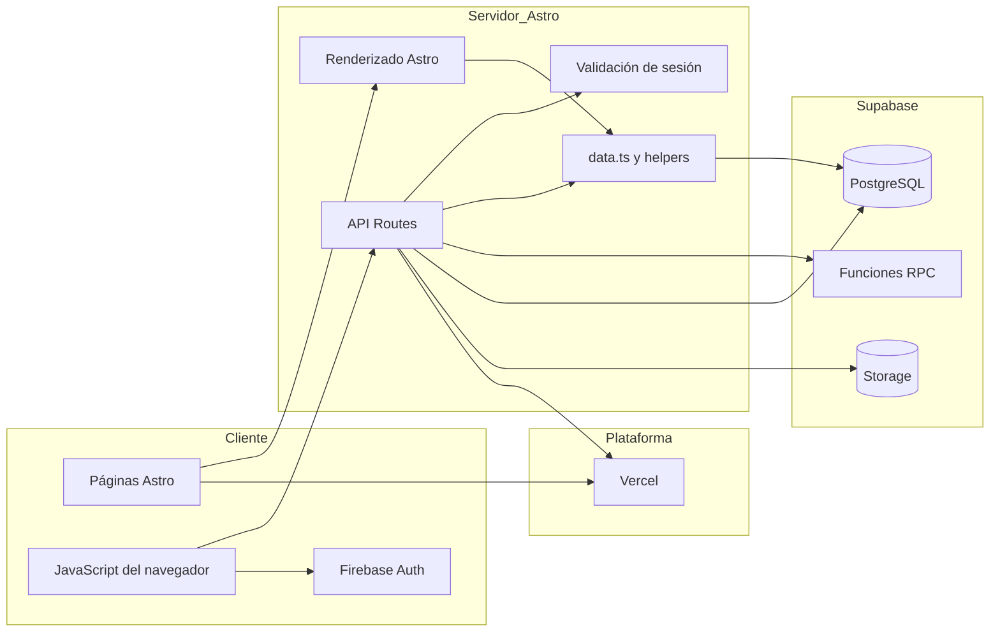
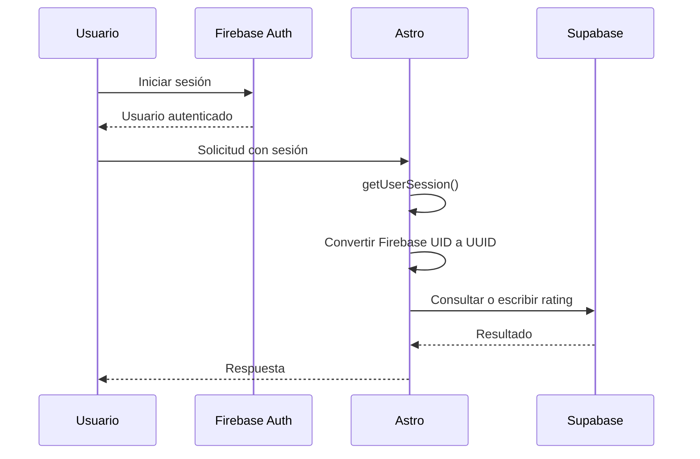
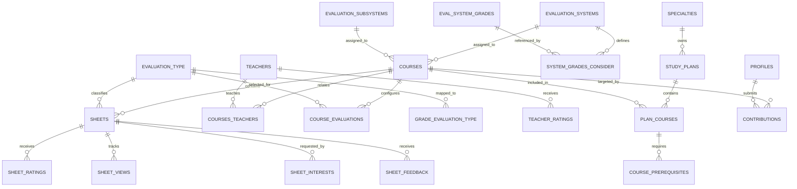
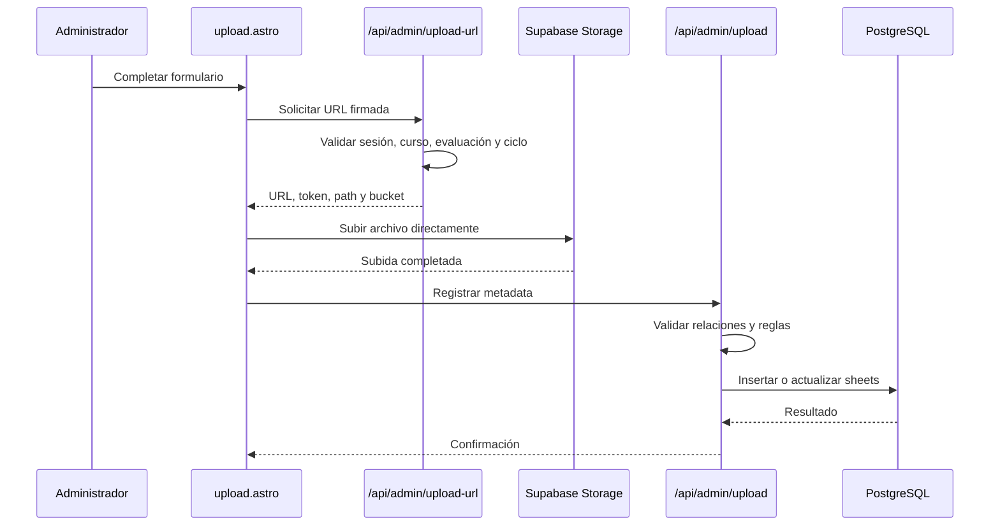
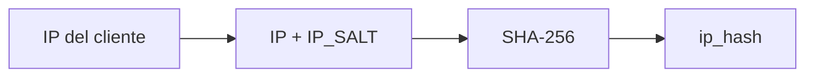

# Arquitectura del Proyecto

## Objetivo

TrikaWeb centraliza recursos académicos, principalmente planchas y solucionarios,
y ofrece funcionalidades para:

- Buscar cursos, profesores y evaluaciones.
- Visualizar y descargar planchas.
- Consultar solucionarios en PDF o video.
- Calificar la dificultad de las planchas.
- Calificar profesores.
- Registrar interés en planchas que todavía no tienen solucionario.
- Administrar cursos, profesores, evaluaciones y archivos desde un panel privado.

La arquitectura separa las operaciones públicas de lectura de las operaciones
sensibles de escritura. Estas últimas se ejecutan mediante endpoints de servidor,
validaciones explícitas y el cliente administrativo de Supabase.

---

## Stack técnico

| Capa | Tecnología |
|---|---|
| **Frontend** | Astro + TypeScript + Tailwind CSS |
| **Backend** | Astro API Routes (`src/pages/api`) |
| **Base de datos** | Supabase PostgreSQL |
| **Storage** | Supabase Storage |
| **Autenticación de estudiantes** | Firebase Authentication |
| **Sesión administrativa** | Cookie `admin_session` validada en el servidor |
| **Deploy** | Vercel mediante `@astrojs/vercel` |
| **Documentación** | Markdown + diagramas Mermaid |

---

## Estructura del proyecto

```text
src/
├── components/
│   ├── AdminHeader.astro
│   ├── SearchAutocomplete.astro
│   ├── SheetRating.astro
│   └── ...
├── layouts/
│   └── Layout.astro
├── lib/
│   ├── adminAuth.ts
│   ├── auth.ts
│   ├── data.ts
│   ├── supabaseAdmin.ts
│   ├── supabaseClient.ts
│   ├── utils.ts
│   ├── client/
│   │   └── device.ts
│   └── server/
│       └── getVisibleSheet.ts
├── pages/
│   ├── admin/
│   │   ├── courses.astro
│   │   ├── teachers.astro
│   │   ├── upload.astro
│   │   └── ...
│   ├── api/
│   │   ├── admin/
│   │   ├── cursos/
│   │   ├── profesores/
│   │   └── sheets/
│   ├── cursos/
│   ├── exams/
│   │   └── [id].astro
│   ├── profesores/
│   └── index.astro
└── styles/
    └── global.css

supabase/
├── migrations/
├── schema.sql
└── function_triggers.sql

docs/
├── api.md
├── arquitectura.md
├── flujos.md
└── setup.md
```

### Responsabilidades principales

- `src/pages`: páginas Astro y endpoints HTTP.
- `src/components`: componentes reutilizables de interfaz.
- `src/lib/data.ts`: consultas compartidas para páginas públicas.
- `src/lib/supabaseAdmin.ts`: cliente exclusivo del servidor con privilegios administrativos.
- `src/lib/supabaseClient.ts`: cliente de Supabase utilizado donde corresponda una sesión o acceso no administrativo.
- `src/lib/auth.ts`: integración de autenticación de estudiantes.
- `src/lib/adminAuth.ts`: validación de la sesión administrativa.
- `src/lib/utils.ts`: hashing, IP del cliente, rate limiting y normalización de identificadores.
- `src/lib/server/getVisibleSheet.ts`: consulta centralizada de planchas visibles y validación del curso asociado.
- `supabase/migrations`: cambios incrementales y versionados del esquema.

---

## Vista general de la arquitectura


```mermaid
flowchart LR
    subgraph Cliente
        PAGE[Páginas Astro]
        CLIENT_JS[JavaScript del navegador]
        FIREBASE[Firebase Auth]
    end

    subgraph Servidor_Astro
        SSR[Renderizado Astro]
        API[API Routes]
        AUTH[Validación de sesión]
        DATA[data.ts y helpers]
    end

    subgraph Supabase
        DB[(PostgreSQL)]
        STORAGE[(Storage)]
        RPC[Funciones RPC]
    end

    subgraph Plataforma
        VERCEL[Vercel]
    end

    PAGE --> SSR
    CLIENT_JS --> API
    CLIENT_JS --> FIREBASE
    SSR --> DATA
    API --> AUTH
    API --> DATA
    API --> RPC
    DATA --> DB
    API --> DB
    API --> STORAGE
    PAGE --> VERCEL
    API --> VERCEL
```

---

## Flujo de datos

1. Las páginas públicas se renderizan con Astro y consultan información mediante
   funciones compartidas de `src/lib/data.ts` o helpers de servidor.
2. Las acciones del navegador llaman endpoints en `src/pages/api`.
3. Las operaciones sensibles utilizan `supabaseAdmin` exclusivamente en el servidor.
4. Las páginas y endpoints que exponen planchas validan que:
   - La plancha exista.
   - `sheets.is_hidden = false`.
   - El curso asociado exista.
   - `courses.is_hidden = false`.
5. Los archivos privados se entregan mediante URLs firmadas o streaming controlado.
6. Los contadores derivados se actualizan mediante triggers o funciones RPC.
7. El panel administrativo requiere una cookie `admin_session` válida.

---

## Autenticación e identidad

### Estudiantes

La autenticación de estudiantes se realiza con Firebase Authentication.


```mermaid
sequenceDiagram
    participant U as Usuario
    participant F as Firebase Auth
    participant A as Astro
    participant S as Supabase

    U->>F: Iniciar sesión
    F-->>U: Usuario autenticado
    U->>A: Solicitud con sesión
    A->>A: getUserSession()
    A->>A: Convertir Firebase UID a UUID
    A->>S: Consultar o escribir rating
    S-->>A: Resultado
    A-->>U: Respuesta
```

Para tablas que almacenan `device_id` como UUID, el backend transforma el UID de
Firebase mediante `getUuidFromFirebaseUid`. De esta forma, el identificador no
depende de un UUID arbitrario enviado por el navegador.

### Administradores

La administración utiliza una cookie `admin_session`.

```mermaid
flowchart LR
    ADMIN[Administrador] --> LOGIN[/api/admin/login]
    LOGIN --> COOKIE[Cookie admin_session]
    COOKIE --> VALIDATE[validateAdminSession]
    VALIDATE -->|válida| ADMIN_API[Endpoints administrativos]
    VALIDATE -->|inválida| DENY[401 o redirección a /admin/login]
```

Las páginas y endpoints administrativos llaman `validateAdminSession` antes de
ejecutar consultas o modificaciones.

---

## Modelo de datos

### Tablas principales

| Tabla | Descripción |
|---|---|
| `courses` | Cursos: `code`, `name`, `summary`, `credits`, sistema/subsistema, `status` e `is_hidden` |
| `teachers` | Profesores: nombre, biografía, estadísticas e `is_hidden` |
| `courses_teachers` | Relación N:M entre cursos y profesores |
| `sheets` | Planchas y solucionarios, evaluación, ciclo, profesor, rutas de Storage y métricas |
| `sheet_ratings` | Calificaciones de dificultad por usuario y plancha |
| `sheet_views` | Registro de vistas o descargas |
| `sheet_interests` | Interés en solucionarios, único por `sheet_id` y `device_id` |
| `sheet_feedback` | Comentarios o feedback asociado a planchas |
| `teacher_ratings` | Calificaciones multidimensionales de profesores |
| `contributions` | Solicitudes de contribución realizadas por usuarios |

### Configuración de evaluaciones

| Tabla | Descripción |
|---|---|
| `evaluation_systems` | Sistemas o fórmulas de evaluación |
| `evaluation_subsystems` | Subsistemas asociados a prácticas, laboratorios o trabajos |
| `evaluation_type` | Tipos de evaluación: prácticas, parcial, final, trabajo, etc. |
| `course_evaluations` | Evaluaciones habilitadas para cada curso |
| `eval_system_grades` | Componentes o rangos del sistema |
| `system_grades_consider` | Pesos utilizados por cada sistema |
| `grade_evaluation_type` | Relación entre componentes y tipos de evaluación |
| `cycles` | Ciclos académicos con código, año y término |

### Planes de estudio

| Tabla | Descripción |
|---|---|
| `study_plans` | Planes de estudio |
| `specialties` | Especialidades o carreras |
| `plan_courses` | Cursos incluidos en un plan |
| `course_prerequisites` | Prerrequisitos entre cursos |

### Seguridad y control

| Tabla | Descripción |
|---|---|
| `write_limits` | Ventanas de rate limiting por IP hasheada |
| `profiles` | Metadatos de perfil y rol de aplicación, cuando corresponda |

---

## Diagrama ER simplificado


```mermaid
erDiagram
    COURSES ||--o{ SHEETS : contains
    COURSES ||--o{ COURSES_TEACHERS : relates
    TEACHERS ||--o{ COURSES_TEACHERS : teaches

    COURSES ||--o{ COURSE_EVALUATIONS : configures
    EVALUATION_TYPE ||--o{ COURSE_EVALUATIONS : selected_for
    EVALUATION_SYSTEMS ||--o{ COURSES : assigned_to
    EVALUATION_SUBSYSTEMS ||--o{ COURSES : assigned_to

    EVALUATION_SYSTEMS ||--o{ SYSTEM_GRADES_CONSIDER : defines
    EVAL_SYSTEM_GRADES ||--o{ SYSTEM_GRADES_CONSIDER : referenced_by
    EVALUATION_TYPE ||--o{ GRADE_EVALUATION_TYPE : mapped_to

    TEACHERS ||--o{ TEACHER_RATINGS : receives
    SHEETS ||--o{ SHEET_RATINGS : receives
    SHEETS ||--o{ SHEET_VIEWS : tracks
    SHEETS ||--o{ SHEET_INTERESTS : requested_by
    SHEETS ||--o{ SHEET_FEEDBACK : receives
    EVALUATION_TYPE ||--o{ SHEETS : classifies

    SPECIALTIES ||--o{ STUDY_PLANS : owns
    STUDY_PLANS ||--o{ PLAN_COURSES : contains
    COURSES ||--o{ PLAN_COURSES : included_in
    PLAN_COURSES ||--o{ COURSE_PREREQUISITES : requires

    COURSES ||--o{ CONTRIBUTIONS : targeted_by
    PROFILES ||--o{ CONTRIBUTIONS : submits
```

---

## Estados de cursos

Los cursos utilizan:

- `INCOMPLETO`
- `COMPLETO`
- `ARCHIVADO`

Un curso puede mantenerse como `INCOMPLETO` cuando falta información necesaria,
por ejemplo:

- Sumilla.
- Subsistema requerido.
- Cantidad correcta de evaluaciones variables.
- Configuración académica coherente.

La subida de planchas y solucionarios se bloquea para cursos incompletos.

---

## Flujo de subida de archivos

La subida se divide en dos etapas para evitar el límite de tamaño de las
funciones de Vercel.


```mermaid
sequenceDiagram
    participant A as Administrador
    participant UI as upload.astro
    participant URL as /api/admin/upload-url
    participant ST as Supabase Storage
    participant META as /api/admin/upload
    participant DB as PostgreSQL

    A->>UI: Completar formulario
    UI->>URL: Solicitar URL firmada
    URL->>URL: Validar sesión, curso, evaluación y ciclo
    URL-->>UI: URL, token, path y bucket
    UI->>ST: Subir archivo directamente
    ST-->>UI: Subida completada
    UI->>META: Registrar metadata
    META->>META: Validar relaciones y reglas
    META->>DB: Insertar o actualizar sheets
    DB-->>META: Resultado
    META-->>UI: Confirmación
```

### Tipos de recurso

- `PLANCHA`
- `SOLUCIONARIO`
- `AMBOS`

### Reglas relevantes

- El ciclo debe respetar el formato `AAAA-T`.
- El curso debe estar completo.
- La evaluación debe pertenecer al curso.
- Si el archivo es específico de un profesor, se valida `courses_teachers`.
- Un `SOLUCIONARIO` no puede registrarse sin una plancha previa.
- `AMBOS` registra las rutas correspondientes a plancha y solucionario.
- Las miniaturas se almacenan separadas del PDF principal.

---

## Acceso a archivos

### Planchas y solucionarios PDF

Los archivos se almacenan en buckets privados y se sirven mediante:

- URL firmada.
- Streaming controlado.
- Descarga controlada.

El endpoint `/api/sheets/:id/file` valida explícitamente la visibilidad de la
plancha y del curso antes de acceder a Storage.

### Solucionarios en video

Cuando `solution_kind = "video"`, se utiliza `solution_video_url`. Antes de
redirigir, el backend valida que la URL sea HTTP o HTTPS.

---

## Triggers y métricas derivadas

Los triggers se definen en las migraciones y en
`supabase/function_triggers.sql`.

| Trigger | Tabla origen | Función | Resultado |
|---|---|---|---|
| `t_sheet_ratings_stats` | `sheet_ratings` | `refresh_sheet_stats` | Recalcula `avg_difficulty` y `rating_count` |
| `t_sheet_views_count` | `sheet_views` | `refresh_view_count` | Recalcula `view_count` |
| `t_sheet_interests_stats` | `sheet_interests` | Función de estadísticas de interés | Mantiene `interest_count` |
| `t_teacher_ratings_stats` | `teacher_ratings` | `refresh_teacher_stats` | Recalcula estadísticas del profesor |
| `set_updated_at` | Tablas con `updated_at` | `set_updated_at` | Actualiza la fecha de modificación |

Los nombres exactos deben mantenerse sincronizados con las migraciones aplicadas
en Supabase.

---

## Funciones RPC

| Función | Propósito |
|---|---|
| `create_course_with_evaluations` | Crea un curso, calcula `status` y registra evaluaciones |
| `update_course_with_evaluations` | Actualiza un curso y reconstruye sus evaluaciones |
| `get_evaluation_systems` | Lista sistemas de evaluación |
| `get_evaluation_subsystems` | Lista subsistemas |
| `get_variable_evaluations_by_system` | Obtiene evaluaciones variables de un sistema |
| `toggle_sheet_interest` | Inserta o elimina interés de forma atómica y devuelve el contador |
| `reset_sheet_interest` | Elimina intereses y restablece el contador de forma atómica |
| `get_average_stars` | Calcula el promedio visible de feedback de plancha |
| `handle_new_user` | Crea metadatos de perfil cuando el flujo de autenticación correspondiente lo utiliza |

### Atomicidad del interés

`toggle_sheet_interest` y `reset_sheet_interest` bloquean la fila de `sheets`
cuando corresponde, modifican `sheet_interests` y recalculan `interest_count`.
Esto evita inconsistencias provocadas por solicitudes concurrentes.

---

## Seguridad

### IP hasheada


```mermaid
flowchart LR
    IP[IP del cliente] --> CONCAT[IP + IP_SALT]
    CONCAT --> HASH[SHA-256]
    HASH --> DB[ip_hash]
```

La IP nunca se persiste en texto plano.

### Rate limiting

`enforceIpRateLimit` consulta o actualiza `write_limits` antes de ejecutar
acciones sensibles. Cuando se excede el límite, el endpoint responde `429`.

### Identificación de votos

- Ratings de planchas y profesores: identidad derivada de la sesión de Firebase.
- Vistas e intereses: pueden utilizar un `device_id` anónimo generado en el cliente.
- La base de datos mantiene restricciones únicas para evitar duplicados.

### Cliente administrativo

`supabaseAdmin` utiliza la Service Key y omite RLS. Por esta razón, cada endpoint
que lo utiliza debe realizar validaciones explícitas de:

- Sesión.
- Existencia del recurso.
- Visibilidad.
- Relaciones entre curso, evaluación y profesor.
- Parámetros recibidos.

---

## Row Level Security

Las políticas exactas se versionan en migraciones. A nivel arquitectónico:

| Recurso | Acceso esperado |
|---|---|
| Cursos, profesores y planchas visibles | Lectura pública controlada |
| Sistemas, subsistemas y ciclos | Lectura pública o autenticada según política |
| Ratings, vistas y rate limits | Escritura mediante backend |
| `sheet_interests` | Sin escritura directa para `anon` o `authenticated`; se modifica mediante RPC/backend |
| Operaciones administrativas | Exclusivamente mediante endpoints con sesión administrativa |
| Storage privado | Acceso mediante URL firmada o backend |

### Regla importante

No debe asumirse que una tabla es segura únicamente por tener RLS habilitado.
Las operaciones realizadas con `supabaseAdmin` ignoran las políticas, por lo que
la autorización debe validarse en el endpoint o función RPC.

---

## Storage buckets

| Bucket | Contenido | Acceso utilizado por la aplicación |
|---|---|---|
| `exams` | Planchas y evaluaciones | URLs firmadas, streaming o descarga |
| `solutions` | Solucionarios PDF | URLs firmadas, streaming o descarga |
| `thumbnails` | Miniaturas | URL firmada o política definida para el bucket |
| `avatars` | Avatares | Según política del bucket |
| `contributions` | Archivos enviados por usuarios | Acceso privado y controlado |

La configuración exacta de MIME types, tamaño máximo y políticas debe mantenerse
en las migraciones o configuración de Supabase Storage.

---

## Variables de entorno críticas

| Variable | Uso |
|---|---|
| `SUPABASE_URL` | URL del proyecto Supabase |
| `SUPABASE_SERVICE_KEY` | Operaciones administrativas del servidor |
| `IP_SALT` | Hasheo de direcciones IP |
| Variables públicas de Firebase | Inicialización de Firebase Auth en el cliente |
| Credenciales privadas de Firebase | Validación del lado servidor cuando corresponda |

### Reglas

- No exponer `SUPABASE_SERVICE_KEY` en código cliente.
- No versionar archivos de credenciales privadas.
- Mantener secretos en variables de entorno locales y de Vercel.
- Usar prefijos públicos únicamente para valores seguros para el navegador.

---

## Deploy

El proyecto utiliza `@astrojs/vercel` con salida de servidor.

```text
Astro
  └── build server
       ├── funciones de servidor
       ├── assets estáticos
       └── output de Vercel
```

Antes de desplegar se recomienda ejecutar:

```bash
npm run check
npm run build
```

El Preview de Vercel debe validar como mínimo:

- Inicio de sesión administrativo.
- Listado y edición de cursos.
- Panel de subida.
- Acceso a planchas.
- Descarga de archivos.
- Solucionarios.
- Ratings.
- Restricciones de visibilidad.

---

## Documentación relacionada

- [`api.md`](api.md): contratos de endpoints.
- [`flujos.md`](flujos.md): flujos y diagramas detallados.
- [`setup.md`](setup.md): instalación y variables de entorno.
- `supabase/migrations`: fuente de verdad de cambios incrementales del esquema.
