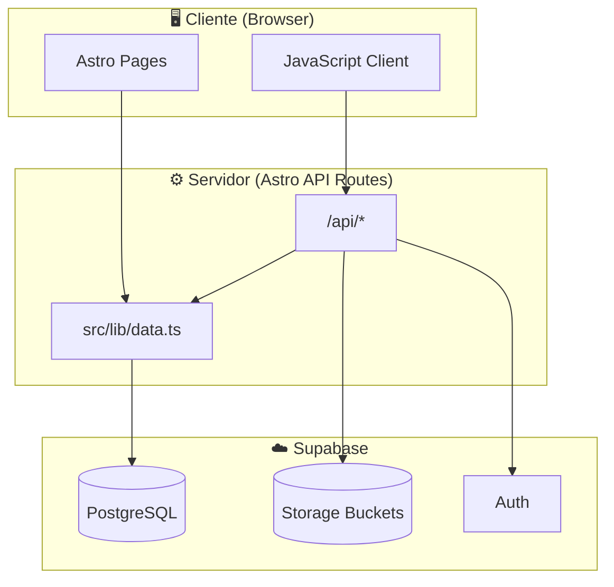
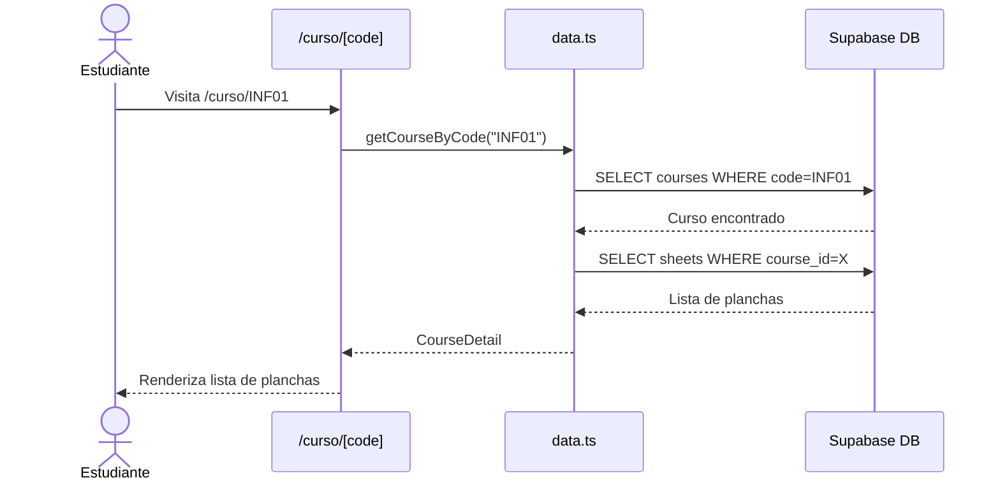
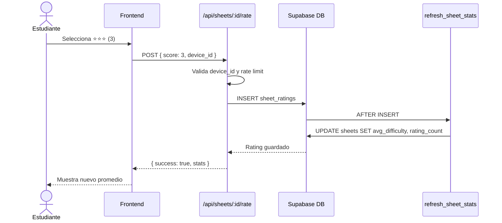
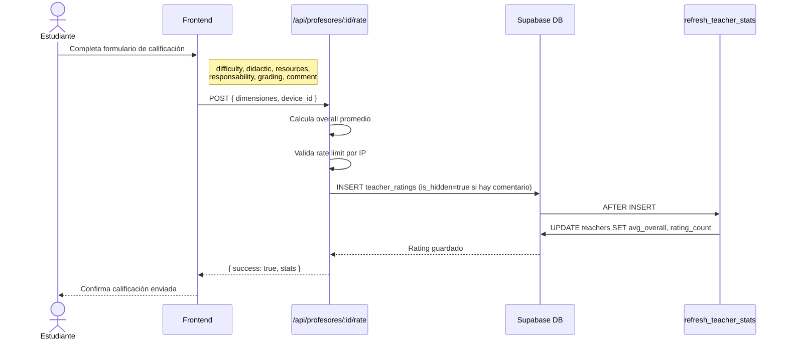
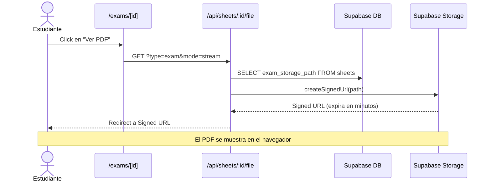
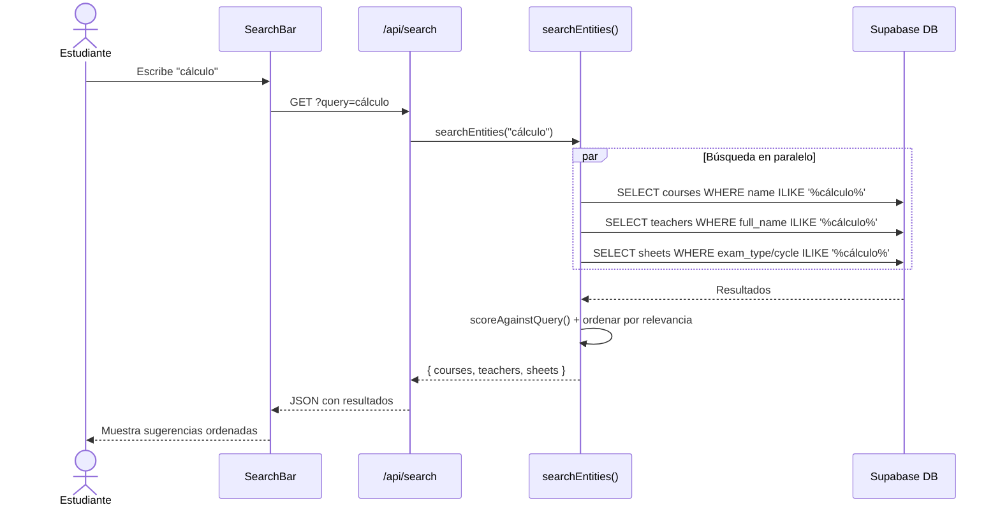
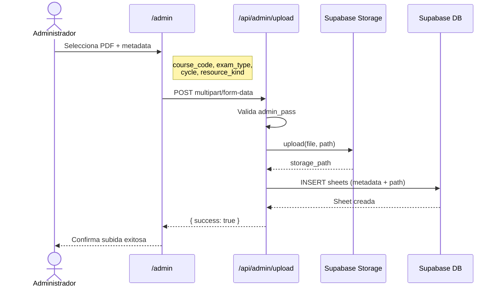
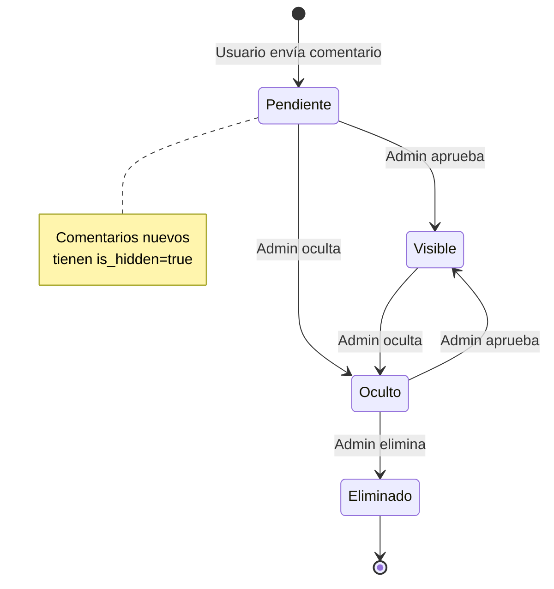
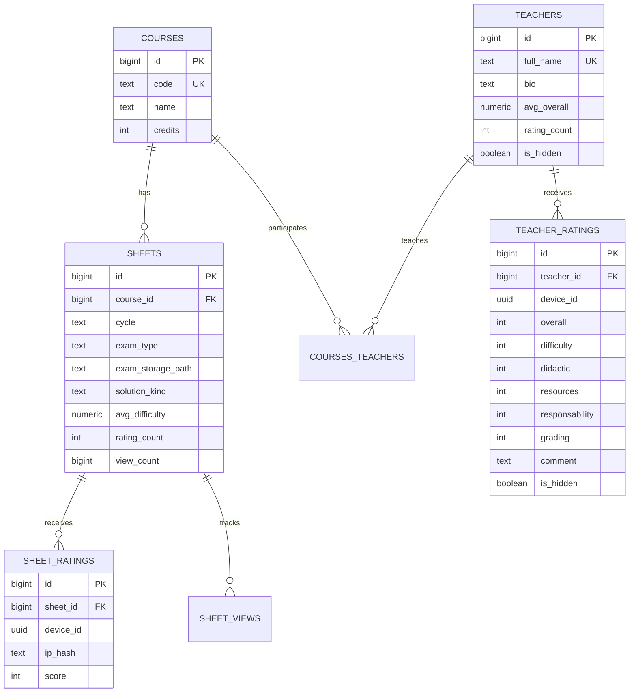
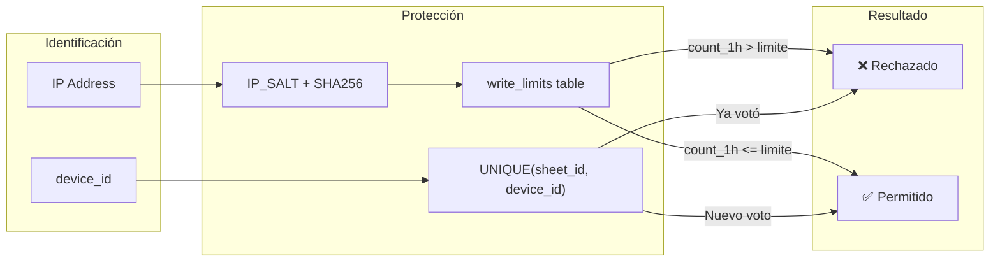

# Flujos del Sistema

Este documento describe los flujos principales de TrikaWeb mediante diagramas visuales.

## Arquitectura General

---

## Flujo: Consulta de Planchas por Curso

Cuando un estudiante visita `/curso/[code]`:

---

## Flujo: Calificación de Plancha

Cuando un usuario califica la dificultad de una plancha:

---

## Flujo: Calificación de Profesor

Cuando un usuario califica a un profesor:

---

## Flujo: Visualización/Descarga de PDF

---

## Flujo: Búsqueda Global

---

## Flujo: Administración - Subida de Plancha

---

## Flujo: Moderación de Comentarios

---

## Modelo de Datos (ER Simplificado)

---

## Sistema Anti-Spam

