# Flujos del Sistema

Este documento describe los flujos principales de TrikaWeb mediante diagramas visuales.

## Arquitectura General

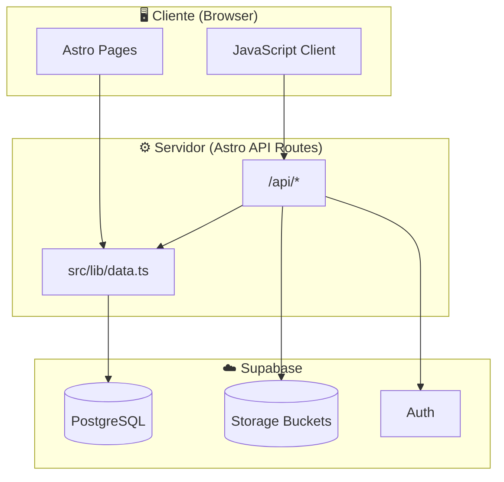
```mermaid
flowchart TB
    subgraph Cliente["🖥️ Cliente (Browser)"]
        UI[Astro Pages]
        JS[JavaScript Client]
    end
    
    subgraph Servidor["⚙️ Servidor (Astro API Routes)"]
        API["/api/*"]
        LIB["src/lib/data.ts"]
    end
    
    subgraph Supabase["☁️ Supabase"]
        DB[(PostgreSQL)]
        STORAGE[("Storage Buckets")]
        AUTH[Auth]
    end
    
    UI --> LIB
    JS --> API
    API --> LIB
    LIB --> DB
    API --> STORAGE
    API --> AUTH
```

---

## Flujo: Consulta de Planchas por Curso

Cuando un estudiante visita `/curso/[code]`:

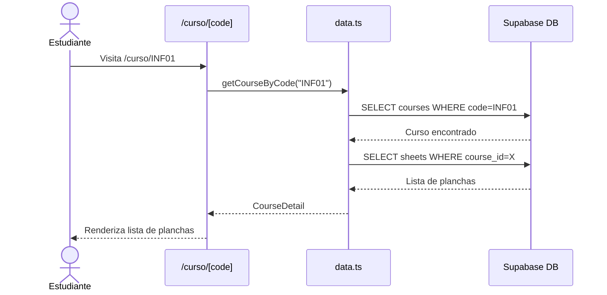
```mermaid
sequenceDiagram
    actor User as Estudiante
    participant Page as /curso/[code]
    participant Data as data.ts
    participant DB as Supabase DB
    
    User->>Page: Visita /curso/INF01
    Page->>Data: getCourseByCode("INF01")
    Data->>DB: SELECT courses WHERE code=INF01
    DB-->>Data: Curso encontrado
    Data->>DB: SELECT sheets WHERE course_id=X
    DB-->>Data: Lista de planchas
    Data-->>Page: CourseDetail
    Page-->>User: Renderiza lista de planchas
```

---

## Flujo: Calificación de Plancha

Cuando un usuario califica la dificultad de una plancha:

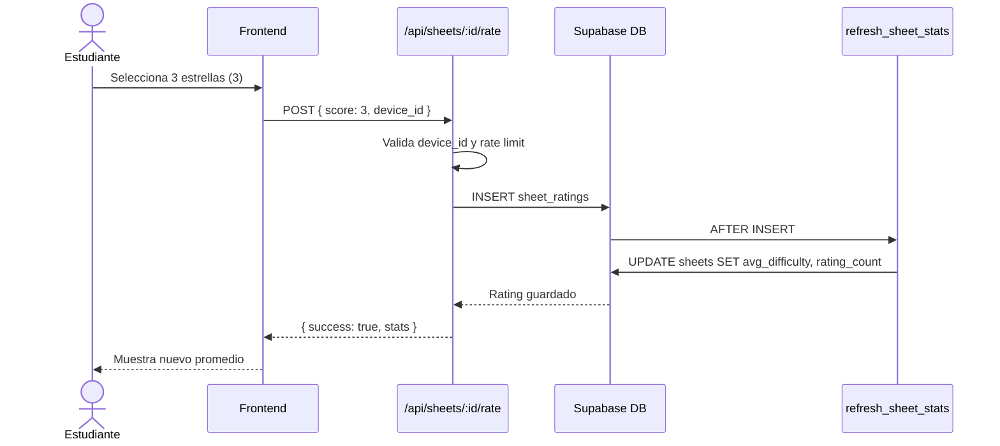
```mermaid
sequenceDiagram
    actor User as Estudiante
    participant UI as Frontend
    participant API as /api/sheets/:id/rate
    participant DB as Supabase DB
    participant Trigger as refresh_sheet_stats
    
    User->>UI: Selecciona 3 estrellas (3)
    UI->>API: POST { score: 3, device_id }
    API->>API: Valida device_id y rate limit
    API->>DB: INSERT sheet_ratings
    DB->>Trigger: AFTER INSERT
    Trigger->>DB: UPDATE sheets SET avg_difficulty, rating_count
    DB-->>API: Rating guardado
    API-->>UI: { success: true, stats }
    UI-->>User: Muestra nuevo promedio
```

---

## Flujo: Calificación de Profesor

Cuando un usuario califica a un profesor:

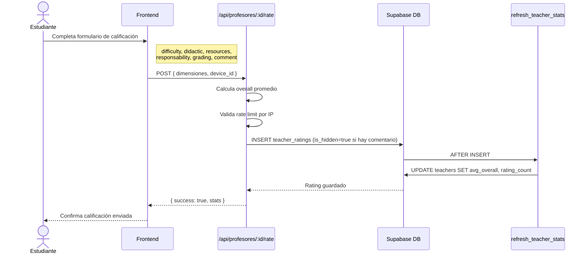
```mermaid
sequenceDiagram
    actor User as Estudiante
    participant UI as Frontend
    participant API as /api/profesores/:id/rate
    participant DB as Supabase DB
    participant Trigger as refresh_teacher_stats
    
    User->>UI: Completa formulario de calificación
    Note right of UI: difficulty, didactic, resources,<br/>responsability, grading, comment
    UI->>API: POST { dimensiones, device_id }
    API->>API: Calcula overall promedio
    API->>API: Valida rate limit por IP
    API->>DB: INSERT teacher_ratings (is_hidden=true si hay comentario)
    DB->>Trigger: AFTER INSERT
    Trigger->>DB: UPDATE teachers SET avg_overall, rating_count
    DB-->>API: Rating guardado
    API-->>UI: { success: true, stats }
    UI-->>User: Confirma calificación enviada
```

---

## Flujo: Visualización/Descarga de PDF

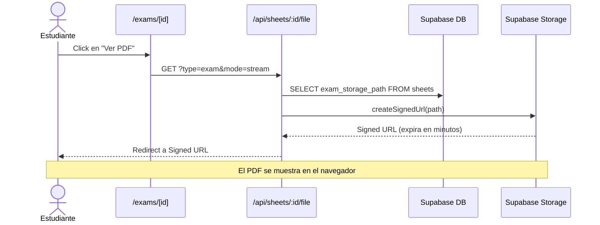
```mermaid
sequenceDiagram
    actor User as Estudiante
    participant Page as /exams/[id]
    participant API as /api/sheets/:id/file
    participant DB as Supabase DB
    participant Storage as Supabase Storage
    
    User->>Page: Click en "Ver PDF"
    Page->>API: GET ?type=exam&mode=stream
    API->>DB: SELECT exam_storage_path FROM sheets
    API->>Storage: createSignedUrl(path)
    Storage-->>API: Signed URL (expira en minutos)
    API-->>User: Redirect a Signed URL
    
    Note over User,Storage: El PDF se muestra en el navegador
```

---

## Flujo: Búsqueda Global

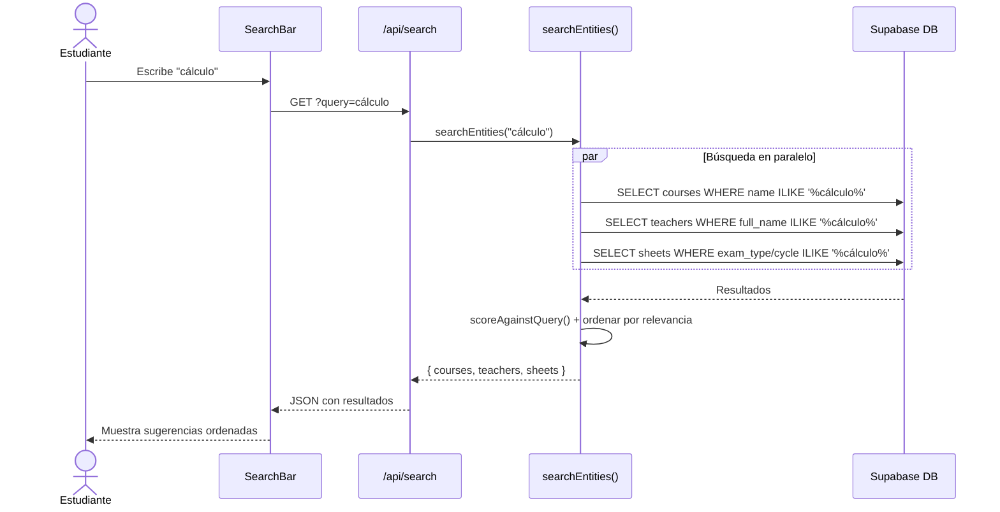
```mermaid
sequenceDiagram
    actor User as Estudiante
    participant UI as SearchBar
    participant API as /api/search
    participant Data as searchEntities()
    participant DB as Supabase DB
    
    User->>UI: Escribe "cálculo"
    UI->>API: GET ?query=cálculo
    API->>Data: searchEntities("cálculo")
    
    par Búsqueda en paralelo
        Data->>DB: SELECT courses WHERE name ILIKE '%cálculo%'
        Data->>DB: SELECT teachers WHERE full_name ILIKE '%cálculo%'
        Data->>DB: SELECT sheets WHERE exam_type/cycle ILIKE '%cálculo%'
    end
    
    DB-->>Data: Resultados
    Data->>Data: scoreAgainstQuery() + ordenar por relevancia
    Data-->>API: { courses, teachers, sheets }
    API-->>UI: JSON con resultados
    UI-->>User: Muestra sugerencias ordenadas
```

---

## Flujos del Módulo de Mallas Curriculares

### Estado y Re-renderizados en la Vista Pública

```
                  ┌──────────────┐
 click en nodo →  │ selectedCourseId │──→ CourseDetailPanel recibe curso
                  └───────┬──────┘
                          │
                   useMemo filtra
                   data.courses
                          │
                  ┌───────▼──────┐
                  │ selectedCourse│──→ Se pasa como prop `course`
                  └──────────────┘

 hover en nodo →  hoveredNode ──→ useMemo recalcula edges con estilos
                                  condicionales (color, strokeWidth, opacity, animated)
```

**Variables de estado locales (`CurriculumInner`):**
- `selectedCourseId`: ID del curso seleccionado; alimenta el panel lateral.
- `hoveredNode`: ID del nodo bajo el cursor; controla highlight de aristas.
- `isFullscreen`: Alterna entre layout incrustado y pantalla completa.
- `minZoom`: Zoom mínimo calculado dinámicamente según el ancho del contenedor.
- `currentZoom`: Zoom actual del viewport; determina indicador "Libre" / "Centrado".

### Navegación por Prerrequisitos (Malla)

Cuando el usuario hace clic en un prerrequisito desde el panel lateral:

1. Se invoca `handlePrerequisiteClick(prerequisiteId)`.
2. Se busca la posición del nodo con `getNode(prerequisiteId)` del hook de ReactFlow.
3. Se centra el viewport en ese nodo usando `setCenter(x + 110, y + 55, { duration: 800, zoom: 1 })`.
4. Se actualiza `selectedCourseId` para que el panel lateral muestre los datos del nuevo curso.

Este flujo permite "navegar" la malla saltando entre cursos sin perder contexto visual.

### Auto-zoom y Encuadre de Malla

Al inicializar o al cambiar el tamaño de la ventana, el viewport se ajusta automáticamente para mostrar la malla completa.

**Fórmula de cálculo (`handleResize`):**
```
minZoom = containerWidth / 3400px (EXTENT_WIDTH)
viewport = { x: X_PADDING * minZoom, y: Y_PADDING * minZoom, zoom: minZoom }
```

### Layout Grid de Nodos

Cada nodo en la malla se posiciona matemáticamente en una cuadrícula fija:
- **Separación horizontal:** 320px (`COLUMN_WIDTH`)
- **Separación vertical:** 160px (`ROW_HEIGHT`)
- **Fórmula:** `x = (cycle - 1) * 320`, `y = row_index * 160`

---

## Flujo: Administración - Subida de Plancha

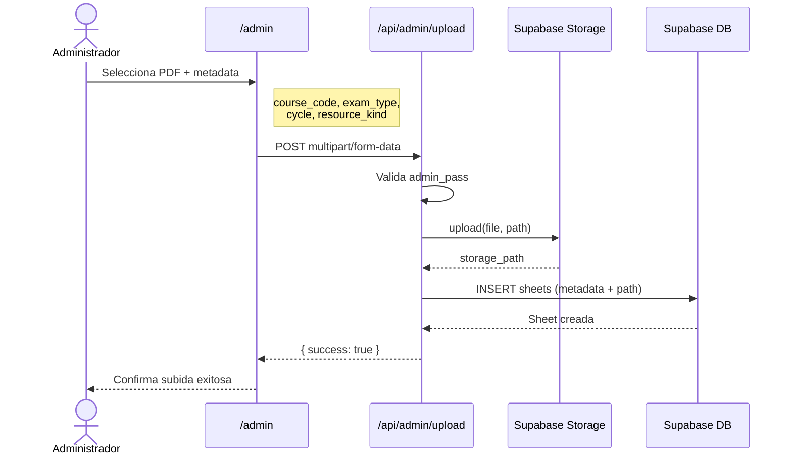
```mermaid
sequenceDiagram
    actor Admin as Administrador
    participant UI as /admin
    participant API as /api/admin/upload
    participant Storage as Supabase Storage
    participant DB as Supabase DB
    
    Admin->>UI: Selecciona PDF + metadata
    Note right of UI: course_code, exam_type,<br/>cycle, resource_kind
    UI->>API: POST multipart/form-data
    API->>API: Valida admin_pass
    API->>Storage: upload(file, path)
    Storage-->>API: storage_path
    API->>DB: INSERT sheets (metadata + path)
    DB-->>API: Sheet creada
    API-->>UI: { success: true }
    UI-->>Admin: Confirma subida exitosa
```

---

## Flujo: Moderación de Comentarios

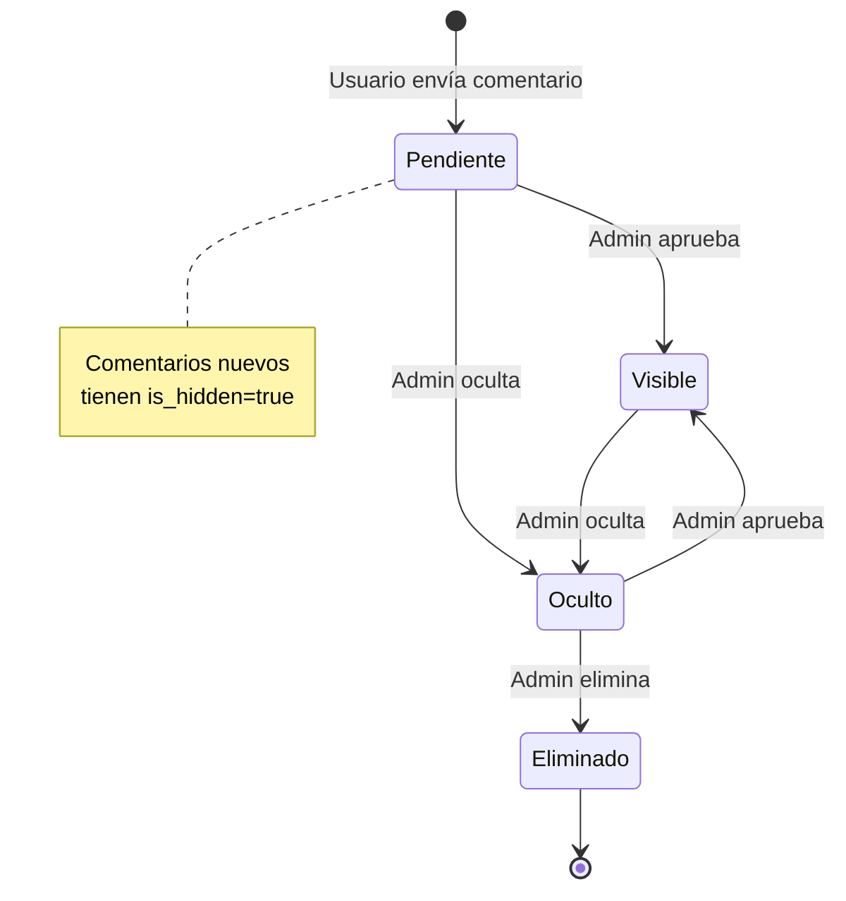
```mermaid
stateDiagram-v2
    [*] --> Pendiente: Usuario envía comentario
    Pendiente --> Visible: Admin aprueba
    Pendiente --> Oculto: Admin oculta
    Visible --> Oculto: Admin oculta
    Oculto --> Visible: Admin aprueba
    Oculto --> Eliminado: Admin elimina
    Eliminado --> [*]
    
    note right of Pendiente
        Comentarios nuevos
        tienen is_hidden=true
    end note
```

---

## Modelo de Datos (ER Simplificado)

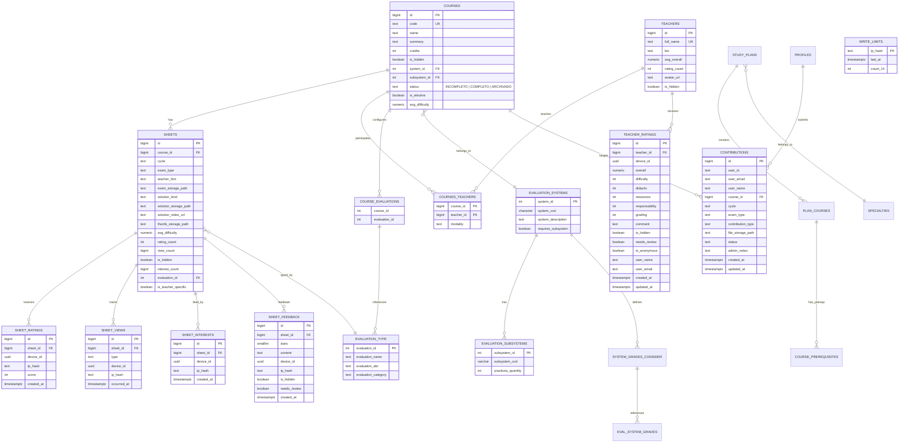
```mermaid
erDiagram
    COURSES ||--o{ SHEETS : has
    COURSES ||--o{ COURSES_TEACHERS : participates
    COURSES ||--o{ COURSE_EVALUATIONS : configures
    COURSE_EVALUATIONS ||--o{ EVALUATION_TYPE : references
    COURSES }o--|| EVALUATION_SYSTEMS : belongs_to
    EVALUATION_SYSTEMS ||--o{ EVALUATION_SUBSYSTEMS : has
    EVALUATION_SYSTEMS ||--o{ SYSTEM_GRADES_CONSIDER : defines
    SYSTEM_GRADES_CONSIDER ||--o{ EVAL_SYSTEM_GRADES : references
    TEACHERS ||--o{ COURSES_TEACHERS : teaches
    TEACHERS ||--o{ TEACHER_RATINGS : receives
    SHEETS ||--o{ SHEET_RATINGS : receives
    SHEETS ||--o{ SHEET_VIEWS : tracks
    SHEETS ||--o{ SHEET_INTERESTS : liked_by
    SHEETS ||--o{ SHEET_FEEDBACK : feedback
    SHEETS }o--|| EVALUATION_TYPE : typed_by
    STUDY_PLANS ||--o{ PLAN_COURSES : contains
    STUDY_PLANS }o--|| SPECIALTIES : belongs_to
    PLAN_COURSES ||--o{ COURSE_PREREQUISITES : has_prereqs
    PROFILES ||--o{ CONTRIBUTIONS : submits
    COURSES ||--o{ CONTRIBUTIONS : targets

    COURSES {
        bigint id PK
        text code UK
        text name
        text summary
        int credits
        boolean is_hidden
        int system_id FK
        int subsystem_id FK
        text status "INCOMPLETO | COMPLETO | ARCHIVADO"
        boolean is_elective
        numeric avg_difficulty
    }

    TEACHERS {
        bigint id PK
        text full_name UK
        text bio
        numeric avg_overall
        int rating_count
        text avatar_url
        boolean is_hidden
    }

    COURSES_TEACHERS {
        bigint course_id PK
        bigint teacher_id PK
        text modality
    }

    SHEETS {
        bigint id PK
        bigint course_id FK
        text cycle
        text exam_type
        text teacher_hint
        text exam_storage_path
        text solution_kind
        text solution_storage_path
        text solution_video_url
        text thumb_storage_path
        numeric avg_difficulty
        int rating_count
        bigint view_count
        boolean is_hidden
        bigint interest_count
        int evaluation_id FK
        boolean is_teacher_specific
    }

    SHEET_RATINGS {
        bigint id PK
        bigint sheet_id FK
        uuid device_id
        text ip_hash
        int score
        timestamptz created_at
    }

    SHEET_VIEWS {
        bigint id PK
        bigint sheet_id FK
        text type
        uuid device_id
        text ip_hash
        timestamptz occurred_at
    }

    SHEET_INTERESTS {
        bigint id PK
        bigint sheet_id FK
        uuid device_id
        text ip_hash
        timestamptz created_at
    }

    SHEET_FEEDBACK {
        bigint id PK
        bigint sheet_id FK
        smallint stars
        text content
        uuid device_id
        text ip_hash
        boolean is_hidden
        boolean needs_review
        timestamptz created_at
    }

    TEACHER_RATINGS {
        bigint id PK
        bigint teacher_id FK
        uuid device_id
        numeric overall
        int difficulty
        int didactic
        int resources
        int responsability
        int grading
        text comment
        boolean is_hidden
        boolean needs_review
        boolean is_anonymous
        text user_name
        text user_email
        timestamptz created_at
        timestamptz updated_at
    }

    EVALUATION_SYSTEMS {
        int system_id PK
        character system_cod
        text system_description
        boolean requires_subsystem
    }

    EVALUATION_SUBSYSTEMS {
        int subsystem_id PK
        varchar subsystem_cod
        int practices_quantity
    }

    EVALUATION_TYPE {
        int evaluation_id PK
        text evaluation_name
        text evaluation_abr
        text evaluation_category
    }

    COURSE_EVALUATIONS {
        int course_id
        int evaluation_id
    }

    CONTRIBUTIONS {
        bigint id PK
        text user_id
        text user_email
        text user_name
        bigint course_id FK
        text cycle
        text exam_type
        text contribution_type
        text file_storage_path
        text status
        text admin_notes
        timestamptz created_at
        timestamptz updated_at
    }

    WRITE_LIMITS {
        text ip_hash PK
        timestamptz last_at
        int count_1h
    }
```

---

## Flujo: Subida con URL Firmada (upload-url)

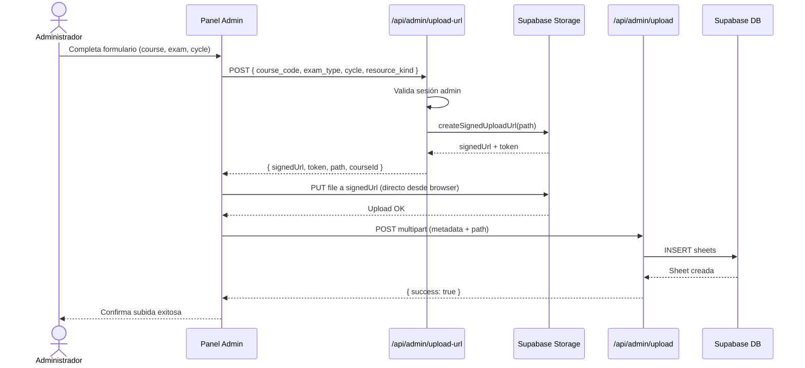
```mermaid
sequenceDiagram
    actor Admin as Administrador
    participant UI as Panel Admin
    participant API1 as /api/admin/upload-url
    participant Storage as Supabase Storage
    participant API2 as /api/admin/upload
    participant DB as Supabase DB

    Admin->>UI: Completa formulario (course, exam, cycle)
    UI->>API1: POST { course_code, exam_type, cycle, resource_kind }
    API1->>API1: Valida sesión admin
    API1->>Storage: createSignedUploadUrl(path)
    Storage-->>API1: signedUrl + token
    API1-->>UI: { signedUrl, token, path, courseId }
    UI->>Storage: PUT file a signedUrl (directo desde browser)
    Storage-->>UI: Upload OK
    UI->>API2: POST multipart (metadata + path)
    API2->>DB: INSERT sheets
    DB-->>API2: Sheet creada
    API2-->>UI: { success: true }
    UI-->>Admin: Confirma subida exitosa
```

---

## Flujo: Interés en Plancha (Toggle)

Cuando un usuario marca/desmarca "me interesa" en una plancha:

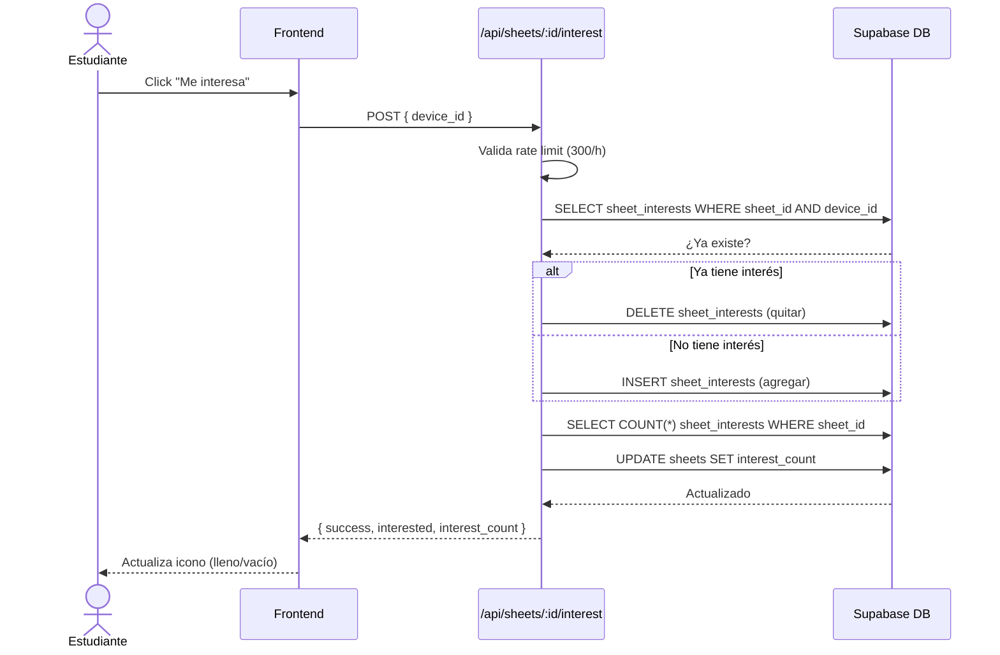
```mermaid
sequenceDiagram
    actor User as Estudiante
    participant UI as Frontend
    participant API as /api/sheets/:id/interest
    participant DB as Supabase DB
    
    User->>UI: Click "Me interesa"
    UI->>API: POST { device_id }
    API->>API: Valida rate limit (300/h)
    API->>DB: SELECT sheet_interests WHERE sheet_id AND device_id
    DB-->>API: ¿Ya existe?

    alt Ya tiene interés
        API->>DB: DELETE sheet_interests (quitar)
    else No tiene interés
        API->>DB: INSERT sheet_interests (agregar)
    end

    API->>DB: SELECT COUNT(*) sheet_interests WHERE sheet_id
    API->>DB: UPDATE sheets SET interest_count
    DB-->>API: Actualizado
    API-->>UI: { success, interested, interest_count }
    UI-->>User: Actualiza icono (lleno/vacío)
```

---

## Flujo: Contribuciones de Usuarios

Cuando un usuario externo envía una contribución (plancha o solucionario):

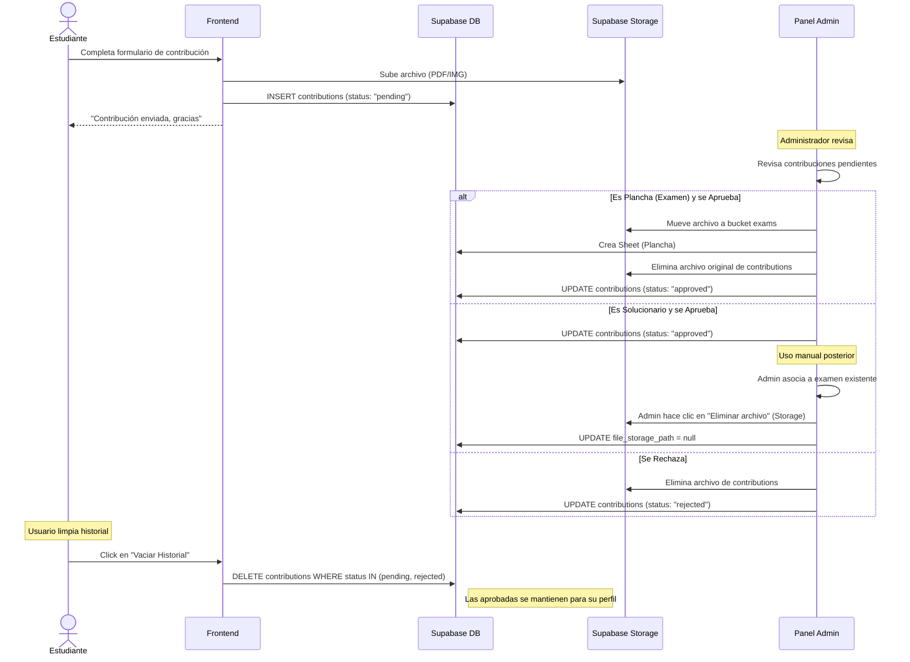
```mermaid
sequenceDiagram
    actor User as Estudiante
    participant UI as Frontend
    participant DB as Supabase DB
    participant Storage as Supabase Storage
    participant AdminUI as Panel Admin
    
    User->>UI: Completa formulario de contribución
    UI->>Storage: Sube archivo (PDF/IMG)
    UI->>DB: INSERT contributions (status: "pending")
    UI-->>User: "Contribución enviada, gracias"

    Note over AdminUI: Administrador revisa
    AdminUI->>AdminUI: Revisa contribuciones pendientes
    
    alt Es Plancha (Examen) y se Aprueba
        AdminUI->>Storage: Mueve archivo a bucket exams
        AdminUI->>DB: Crea Sheet (Plancha)
        AdminUI->>Storage: Elimina archivo original de contributions
        AdminUI->>DB: UPDATE contributions (status: "approved")
    else Es Solucionario y se Aprueba
        AdminUI->>DB: UPDATE contributions (status: "approved")
        Note over AdminUI: Uso manual posterior
        AdminUI->>AdminUI: Admin asocia a examen existente
        AdminUI->>Storage: Admin hace clic en "Eliminar archivo" (Storage)
        AdminUI->>DB: UPDATE file_storage_path = null
    else Se Rechaza
        AdminUI->>Storage: Elimina archivo de contributions
        AdminUI->>DB: UPDATE contributions (status: "rejected")
    end
    
    Note over User: Usuario limpia historial
    User->>UI: Click en "Vaciar Historial"
    UI->>DB: DELETE contributions WHERE status IN (pending, rejected)
    Note right of DB: Las aprobadas se mantienen para su perfil
```

---

## Sistema Anti-Spam

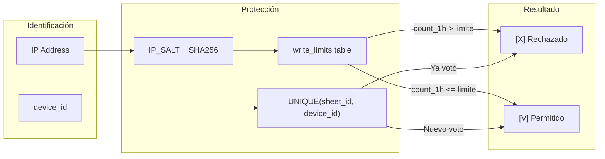
```mermaid
flowchart LR
    subgraph Identificación
        IP[IP Address]
        DEVICE[device_id]
    end
    
    subgraph Protección
        HASH["IP_SALT + SHA256"]
        LIMIT["write_limits table"]
        UNIQUE["UNIQUE(sheet_id, device_id)"]
    end
    
    subgraph Resultado
        BLOCK["[X] Rechazado"]
        ALLOW["[V] Permitido"]
    end
    
    IP --> HASH
    HASH --> LIMIT
    DEVICE --> UNIQUE
    
    LIMIT -->|"count_1h > limite"| BLOCK
    LIMIT -->|"count_1h <= limite"| ALLOW
    UNIQUE -->|"Ya votó"| BLOCK
    UNIQUE -->|"Nuevo voto"| ALLOW
```